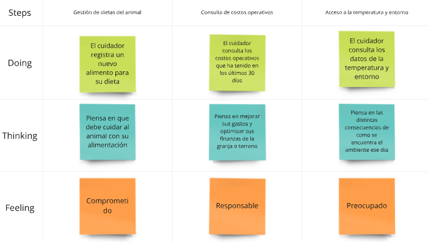
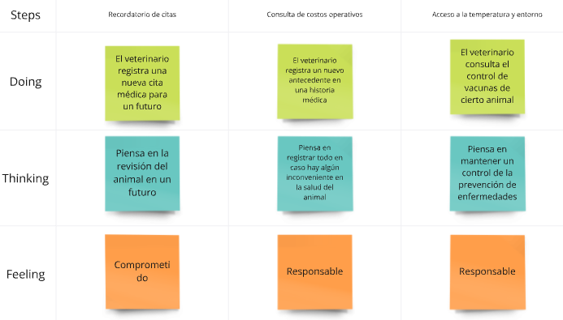

# Capítulo III: Requirements Specification

## 3.1. To-Be Scenario Mapping.

El To-Be Scenario Mapping es una técnica utilizada para visualizar cómo será la experiencia futura de los usuarios al interactuar con un producto o servicio, después de implementar mejoras o cambios. A diferencia del As-Is Scenario Mapping, que refleja el estado actual, el To-Be muestra el escenario deseado, donde se optimizan los procesos, se eliminan obstáculos y se mejoran las emociones y percepciones de los usuarios.

En el caso del segmento de veterinarias, el To-Be Scenario Mapping describe cómo será su interacción con FarmGuard, desde la identificación del problema hasta el registro en la aplicación, destacando los beneficios y mejoras en su experiencia. Este método permite a las veterinarias administrar las historias clínicas de sus pacientes de manera más eficiente, lo que reduce los errores y ayuda a optimizar las operaciones.

**Cuidadores de animales en terrenos de productores agropecuarios:**

**Veterinarias:**

[Enlace de Miro](https://miro.com/app/board/uXjVKiLniSg=/?share_link_id=58992610792)

## 3.2. User Stories

En la sección de historias de usuarios, detallaremos las diversas necesidades y requerimientos de nuestros usuarios y veterinarios. Cada historia de usuario representará un escenario o una función que la plataforma debe proporcionar para cumplir con nuestro objetivo principal: ofrecer una solución completa para la gestión de la salud animal.

Proporcionar a los usuarios herramientas efectivas para el monitoreo, registro y análisis de la salud de los animales en granjas y clínicas veterinarias es el objetivo principal. Esto permitirá a los dueños de granjas y veterinarios tomar decisiones informadas y reducir los riesgos asociados con la salud animal. Al detallar estas historias de usuario, podremos comprender mejor cómo la plataforma satisfará las necesidades de ambos grupos y ofrecer una solución completa y eficiente para la administración de la salud de los animales.

<table>
<colgroup>
<col style="width: 11%" />
<col style="width: 15%" />
<col style="width: 21%" />
<col style="width: 39%" />
<col style="width: 11%" />
</colgroup>
<tbody>
<tr class="odd">
<td>Epic / Story ID</td>
<td>Título</td>
<td>Descripción</td>
<td>Criterios de Aceptación</td>
<td>Relación Epic ID</td>
</tr>
<tr class="even">
    <td>E1-US01</td>
    <td>Gestión digital de la granja</td>
    <td>
        
<strong>Como</strong> productor agropecuario familiarizado con la tecnología,

        
<strong>Quiero</strong> digitalizar la gestión de mis animales 

        
<strong>Para</strong> poder acceder a toda la información desde cualquier dispositivo y agilizar mis operaciones. 

    </td>
    <td>
        
Escenario 1: Acceso a la plataforma desde múltiples dispositivos

        
<strong>Dado</strong> que el usuario esta familiarizado con dispositivos tecnologicos,

        
<strong>Cuando</strong> accede a la plataforma desde su movil o computadora,

        
<strong>Entonces</strong> podrá visualizar, aregar y actualizar la informacion de los animales de su granja de manera remota.

        
Escenario 2: Actualización automática en tiempo real
        
<strong>Dado</strong> que el usuario ha actualizado los datos de su granja,

        
<strong>Cuando</strong> ingresa nuevas entradas en la plataforma

        
<strong>Entonces</strong> los cambios se sincronizarán automaticamente en todos sus dispositivos

    </td>
    <td>1</td>
</tr>
<tr class="odd">
<td>E1-US02</td>
<td>Monitoreo de indicadores clave</td>
<td>

<strong>Como</strong> productor agropecuario con expriencia tecnológica,

<strong>Quiero</strong> monitorear indicadores clave de salud de los animales en tiempo real 

<strong>Para</strong> tomar decisiones más informadas y mejorar la productividad de mi granja.

</td>
<td>

Escenario 1: Indicadores en tiempo real

<strong>Dado</strong> que el usuario tiene acceso a sensores de la granja.

<strong>Cuando</strong> abre la plataforma 

<strong>Entonces</strong> podrá ver los indicadores de salud actualizados de los animales, como tempertura, peso, y frecuencia cardíaca 

Escenario 2: Actualización automática en tiempo real

<strong>Dado</strong> que el usuario ha actualizado los datos de su granja,

<strong>Cuando</strong> ingresa nuevas entradas en la plataforma

<strong>Entonces</strong> los cambios se sincronizaran automaticamente en todos sus dispositivos

</td>
<td>1</td>
</tr>
<tr class="even">
<td>E1-US03</td>
<td>Integración con Equipos y Sensores</td>
<td>

<strong>Como</strong> productor agropecuario interesado en la innovación,

<strong>Quiero</strong> integrar la plataforma con sensores y dispositivos en mi granja

<strong>Para</strong> automatizar el monitoreo de la salud de los animales y reducir la intervención manual

</td>
<td>

Escenario 1: Conexión de dispositivos

<strong>Dado</strong> que el usuario cuenta con sensores instalados

<strong>Cuando</strong> los dispositivos se conecten a la plataforma, 

<strong>Entonces</strong> la información se actualizará automáticamente en la aplicación sin intervención manual. 

Escenario 2: Automatización de tareas repetitivas

<strong>Dado</strong> que el usuario ha integrado sus dispositivos,

<strong>Cuando</strong> un animal cumpla con ciertos criterios predeterminados, 

<strong>Entonces</strong> la plataforma ejecutará acciones automáticas, como registrar una vacuna aplicada

</td>
<td>1</td>
</tr>
<tr class="odd">
<td>E2-US01</td>
<td>Herramientas de Aprendizaje</td>
<td>

<strong>Como</strong> productor agropecuario con poca capacitación, 

<strong>Quiero</strong> acceder a recursos educativos dentro de la plataforma

<strong>Para</strong> aprender más sobre la gestión efectiva de mi granja y mejorar el bienestar de mis animales

</td>
<td>

Escenario 1: Acceso a material educativo

<strong>Dado</strong> que el usuario tiene poca experiencia en la gestión de granjas,

<strong>Cuando</strong> accede a la plataforma, 

<strong>Entonces</strong> podrá visualizar tutoriales y guías que le enseñen buenas prácticas para la gestión de la salud animal. 

Escenario 2: Retroalimentación educativa

<strong>Dado</strong> que el usuario está completando un tutorial,

<strong>Cuando</strong> finaliza una lección, 

<strong>Entonces</strong> recibirá retroalimentación automática sobre su progreso y recomendaciones adicionales.

</td>
<td>2</td>
</tr>
<tr class="even">
<td>E2-US02</td>
<td>Simplificación de tareas</td>
<td>

<strong>Como</strong> productor agropecuario sin experiencia tecnológica,

<strong>Quiero</strong> que la aplicación tenga una interfaz sencilla y fácil de usar

<strong>Para</strong> poder gestionar mi granja sin necesidad de conocimientos avanzados en tecnología

</td>
<td>

Escenario 1: Interfaz de usuario simplificada

<strong>Dado</strong> que el usuario no está familiarizado con aplicaciones complejas

<strong>Cuando</strong> accede a la plataforma, 

<strong>Entonces</strong> verá una interfaz amigable y simplificada con iconos y pasos claros para realizar tareas básicas

Escenario 2: Guías de usuario

<strong>Dado</strong> que el usuario está usando la paltaforma por primera vez,

<strong>Cuando</strong> se enfrente a una nueva funcionalidad,

<strong>Entonces</strong> se le proporcionará una guía paso a paso para completar la tarea.

</td>
<td>2</td>
</tr>
<tr class="odd">
<td>E2-US03</td>
<td>Guia Paso a Paso</td>
<td>

<strong>Como</strong> productor agropecuario que no ha recibido capacitacion,

<strong>Quiero</strong> seguir un proceso guiado paso a paso

<strong>Para</strong> registrar el estado de mis animales y recibir recomendaciones automáticas sobre sus cuidados, sin necesidad de entender términos complejos

</td>
<td>

Escenario 1: Registro guiado de animales

<strong>Dado</strong> que el usuario está registrando un nuevo animal,

<strong>Cuando</strong> complete cada paso del registro, 

<strong>Entonces</strong> la plataforma le proporcionará instrucciones claras y sencillas para llenar los campos correctamente.

Escenario 2: Recomendaciones personalizadas

<strong>Dado</strong> que el usuario ha completado el registro de un animal,

<strong>Cuando</strong> se detecten necesidades específicas de ese animal,

<strong>Entonces</strong> la plataforma le proporcionará recomendaciones automáticas sobre cuidados o tratamientos necesarios.

</td>
<td>2</td>
</tr>
<tr class="even">
<td>E3-US01</td>
<td>Predicción de necesidades alimenticias</td>
<td>

<strong>Como</strong> productor agropecuario interesado en en mejorar productividad y la salud del ganado,

<strong>Quiero</strong> que la plataforma ofresca predicciones de necesidades alimenticias basandose en las características del animal 

<strong>Para</strong> poder optimizar el uso de los recursos disponibles y asegurar la salud de los animales. 

</td>
<td>

Escenario 1: Recomendaciones de dieta

<strong>Dado</strong> que los animales tienen sus datos actualizados,

<strong>Cuando</strong> el usuario consulte las necesidades alimenticias,

<strong>Entonces</strong> la plataforma le mostrará dietas racomendadas para cada animal.

Escenario 2: Ajuste de cantidad de alimentos

<strong>Dado</strong> que el peso y edad de los animales ha cambiado,

<strong>Cuando</strong> el sistema analice los nuevos datos

<strong>Entonces</strong> se reajustará las recomendaciones de dietas de acuerdo a las nuevas características de los animales

</td>
<td>3</td>
</tr>
<tr class="odd">
<td>E3-US02</td>
<td>Alertas de emergencia por salud animal</td>
<td>

<strong>Como</strong> productor agropecuario interesado en la salud de mis animales,

<strong>Quiero</strong> recibir alertas caundo alguno de mis animales presente anomalías en su salud

<strong>Para</strong> poder tomar las acciones necesarias en la salud de mis animales

</td>
<td>

Escenario 1: Deteccion de anomalias en la salud del animal

<strong>Dado</strong> que los animales estan conectado a sensores que monitorean su salud,

<strong>Cuando</strong> se detecten datos fuera de lo normal, 

<strong>Entonces</strong> la plataforma enviara una alerta al dispositivo vinculado con detalles de la salud del animal.

Escenario 2: Planes de acción

<strong>Dado</strong> que el sistema ha emitido una alerta del estado de salud del animal,

<strong>Cuando</strong> el usuario habra la alerta en su dispositivo,

<strong>Entonces</strong> la plataforma le proporcionará tratamientos e instrucciones para atender cualquier emergencia.

</td>
<td>3</td>
</tr>
<tr class="even">
<td>E4-US01</td>
<td>Gestión de inventarios de insumos</td>
<td>

<strong>Como</strong> productor agropecuario que desea tener control preciso de los insumos de la granja,

<strong>Quiero</strong> gestionar el inventario de los insumos (alimentos, medicinas, etc) dentro de la plataforma 

<strong>Para</strong> poder tener un mejor manejo de los recursos disponibles y evitar desabastecimiento. 

</td>
<td>

Escenario 1: Registro automatico de insumos

<strong>Dado</strong> que el usuario ingresa los nuevos insumos al almacén,

<strong>Cuando</strong> se registre las entradas de nuevos insumos,

<strong>Entonces</strong> la plataforma  actualizara automaticamente el inventario disponible e informara si hace falta algun insumo.

Escenario 2: Generación de informes de insumos

<strong>Dado</strong> que el usuario desea analizar el uso de insumos,

<strong>Cuando</strong> el sistema genere un reporte de inventario

<strong>Entonces</strong> la plataforma mostrara el historial de ingreso y uso de insumos

</td>
<td>4</td>
</tr>
<tr class="odd">
<td>E4-US02</td>
<td>Planificacion de actividades agricolas</td>
<td>

<strong>Como</strong> productor agropecuario con actividades programadas,

<strong>Quiero</strong> planificar las actividades diarias de mi granja (limpieza, alimentacion, vacunacion, etc.) dentro de la plataforma

<strong>Para</strong> poder garantizar un mejor manejo del tiempo para realizar exitosamente todas las actividades diarias

</td>
<td>

Escenario 1: Calendario de actividades

<strong>Dado</strong> que el usuario desea tener planificado las actividades diarias

<strong>Cuando</strong> se cree un plan en la plataforma, 

<strong>Entonces</strong> se podra visualizar un cronograma con las tareas hechas y por hacer, ademas recibir notificaciones de recordatorio.

Escenario 2: Asignacion de tareas

<strong>Dado</strong> que exiten multiples tareas diarias,

<strong>Cuando</strong> el usuario planifique las actividades diarias,

<strong>Entonces</strong> se podra asignar tareas a empleados especificos, y ellos recibiran una notificacion con las tareas que se les fueron asignadas.

</td>
<td>4</td>
</tr>
<tr class="even">
    <td>E5-US011 </td>
    <td>Sección sobre los planes del Landing Page de FarmGuard</td>
    <td>
        
<strong>Como</strong> visitante del sitio estatico,

        
<strong>Quiero</strong> tener informacion sobre los planes disponibles de la app web. 

        
<strong>Para</strong> poder considerar la adquisicion de uno de estos. 

    </td>
    <td>
        
Escenario 1: Buscar los planes disponibles.

        
<strong>Dado</strong> que el visitante esta interesado en los planes disponibles,

        
<strong>Cuando</strong> accede al landing page a la seccion de planes,

        
<strong>Entonces</strong> podrá visualizar, los diferentes planes disponibles y leer la informacion clara y precisa.

        
Escenario 2: No encuentra los planes disponibles.
        
<strong>Dado</strong> que el visitante esta interesado en los planes disponibles,

        
<strong>Cuando</strong>accede al landing page a la seccion de planes,

        
<strong>Entonces</strong> la seccion de planes no aparece correctamente y no carga la informacion importante.

    </td>
    <td>5</td>
</tr>
<tr class="odd">
    <td>E5-US12</td>
    <td>Sección sobre los beneficios del Landing Page de FarmGuard</td>
    <td>
        
<strong>Como</strong> visitante del sitio estatico,

        
<strong>Quiero</strong> tener informacion sobre los beneficios que me brinda la app web. 

        
<strong>Para</strong> poder considerar el uso de esta misma.

    </td>
    <td>
        
Escenario 1: Buscar la seccion de beneficios

        
<strong>Dado</strong> que el visitante esta interesado en los beneficios de la app web,

        
<strong>Cuando</strong> cuando presione en el boton de Beneficios en el navbar, 

        
<strong>Entonces</strong> se podra visualizar la seccion de los beneficios con sus respectivas imagenes con tiempos de carga cortos.

        
Escenario 2: No se encuentra la seccion de beneficios.

        
<strong>Dado</strong> que el visitante esta interesado en los beneficios de la app web,

        
<strong>Cuando</strong> cuando presione en el boton de Beneficios en el navbar,

        
<strong>Entonces</strong> la pagina no lo redirrecciona a la seccion respectiva.

    </td>
    <td>5</td>
</tr>
<tr class="even">
    <td>E5-US013 </td>
    <td>Sección de contactanos del Landing Page de FarmGuard</td>
    <td>
        
<strong>Como</strong> visitante del sitio estatico,

        
<strong>Quiero</strong> tener la opcion de poder de contactar con el equipo de desarrollo 

        
<strong>Para</strong> poder tener mas informacion.

    </td>
    <td>
        
Escenario 1: Buscar el formulario para contactar al equipo.

        
<strong>Dado</strong> que el visitante esta interesado contactar con el equipo de desarrollo,

        
<strong>Cuando</strong> accede al landing page a la seccion de contactanos,

        
<strong>Entonces</strong> el visitante navega hasta esa seccion para poder llenar su informacion y enviar sus datos para la consulta.

    </td>
    <td>5</td>
</tr>
<tr class="odd">
    <td>E5-US14</td>
    <td>Sección sobre los integrantes del Landing Page de FarmGuard</td>
    <td>
        
<strong>Como</strong> visitante del sitio estatico,

        
<strong>Quiero</strong> tener informacion sobre los creadores de la app web. 

        
<strong>Para</strong> poder saber mas sobre el equipo detras de la app web.

    </td>
    <td>
        
Escenario 1: Buscar la seccion de Nosotros

        
<strong>Dado</strong> que el visitante esta interesado en saber del equipo detras de la app web,

        
<strong>Cuando</strong>presione en el boton de Nosotros en el navbar, 

        
<strong>Entonces</strong> se podra visualizar la seccion Nosotros con sus respectivas imagenes con tiempos de carga cortos y descripciones de cada miembro.

        
Escenario 2: No carga la seccion nosotros.

        
<strong>Dado</strong> que el visitante esta interesado en conocer los desarrolladores de la app web,

        
<strong>Cuando</strong> presione en el boton de Nosotros en el navbar,

        
<strong>Entonces</strong> la pagina no lo redirrecciona a la seccion respectiva y no carga la informacion.

    </td>
    <td>5</td>
</tr>
<tr class="even">
    <td>E5-US015 </td>
    <td>Boton de accion del Landing Page a FarmGuard</td>
    <td>
        
<strong>Como</strong> visitante del sitio estatico,

        
<strong>Quiero</strong> tener la opcion de poder dirigirme a la app web  

        
<strong>Para</strong> para poder usarla.

    </td>
    <td>
        
Escenario 1: Presiona un boton para dirigirse al app web.

        
<strong>Dado</strong> que el visitante esta buscando ir a la app web,

        
<strong>Cuando</strong> presiona el boton de accion,

        
<strong>Entonces</strong> este le redirige a la app web.

        
Escenario 2: Presiona un boton para dirigirse al app web y no pasa nada.

        
<strong>Dado</strong> que el visitante esta buscando ir a la app web,

        
<strong>Cuando</strong> presiona el boton de accion,

        
<strong>Entonces</strong> el boton no realiza ninguna accion.

    </td>
    <td>5</td>
</tr>
</tbody>
</table>

## 3.3. Impact Mapping.

La sección de Impact Mapping analizará las consecuencias más amplias y los objetivos estratégicos que buscamos lograr con la implementación de esta aplicación. En lugar de concentrarnos en detalles técnicos o funcionalidades específicas, el Impact Mapping nos ayudará a comprender cómo funciona.

Nuestro proyecto ayudará a lograr objetivos más grandes y cómo tendrá un impacto positivo en varios grupos de interés. Este Impact Mapping nos ayudará a identificar cómo las características de la aplicación se relacionan con los resultados deseados, lo que nos permitirá tomar decisiones informadas sobre qué aspectos priorizar y cómo medir el éxito a largo plazo.

## 3.4. Product Backlog.
<table>
<colgroup>
<col style="width: 13%" />
<col style="width: 12%" />
<col style="width: 18%" />
<col style="width: 28%" />
<col style="width: 14%" />
<col style="width: 12%" />
</colgroup>
<thead>
<tr class="header">
<th>#Orden</th>
<th>User Story ID</th>
<th>Titulo</th>
<th>Descripcion</th>
<th>Prioridad</th>
<th>Story Points</th>
</tr>
</thead>
<tbody>

<tr class="odd">
<td>1</td>
<td>E1-US01</td>
<td>Gestión digital de la granja</td>
<td>
<strong>Como</strong> productor agropecuario familiarizado con la tecnología,

<strong>quiero</strong> digitalizar la gestión de mis animales

<strong>para</strong> poder acceder a toda la información desde cualquier dispositivo y agilizar mis operaciones.
</td>
<td>Alta</td>
<td>8</td>
</tr>
<tr class="even">
<td>2</td>
<td>E1-US02	</td>
<td>Monitoreo de indicadores clave</td>
<td>
<strong>Como</strong> productor agropecuario con expriencia tecnológica,

<strong>quiero</strong> monitorear indicadores clave de salud de los animales en tiempo real.

<strong>para</strong> tomar decisiones más informadas y mejorar la productividad de mi granja.
</td>
<td>Alta</td>
<td>8</td>
</tr>
<tr class="odd">
<td>3</td>
<td>E1-US03	</td>
<td>Integración con Equipos y Sensores</td>
<td>
<strong>Como</strong> productor agropecuario interesado en la innovación,

<strong>quiero</strong> integrar la plataforma con sensores y dispositivos en mi granja

<strong>para</strong> automatizar el monitoreo de la salud de los animales y reducir la intervención manual.
</td>
<td>Alta</td>
<td>13</td>
</tr>

<tr class="even">
<td>4</td>
<td>E2-US01</td>
<td>Herramientas de aprendizaje</td>
<td>
<strong>Como</strong> productor agropecuario con poca capacitación,

<strong>quiero</strong> acceder a recursos educativos dentro de la plataforma

<strong>para</strong> aprender más sobre la gestión efectiva de mi granja y mejorar el bienestar de mis animales.
</td>
<td>Media</td>
<td>5</td>
</tr>

<tr class="odd">
<td>5</td>
<td>E2-US02</td>
<td>Simplificación de tareas</td>
<td>
<strong>Como</strong> productor agropecuario sin experiencia tecnológica,

<strong>quiero</strong> que la aplicación tenga una interfaz sencilla y fácil de usar

<strong>para</strong> poder gestionar mi granja sin necesidad de conocimientos avanzados en tecnología.
</td>
<td>Media</td>
<td>5</td>
</tr>

<tr class="even">
<td>6</td>
<td>E2-US03</td>
<td>Guia Paso a Paso</td>
<td>
<strong>Como</strong> productor agropecuario que no ha recibido capacitacion,

<strong>quiero</strong> seguir un proceso guiado paso a paso

<strong>para</strong> registrar el estado de mis animales y recibir recomendaciones automáticas sobre sus cuidados, sin necesidad de entender términos complejos.
</td>
<td>Media</td>
<td>5</td>
</tr>

<tr class="odd">
<td>7</td>
<td>E3-US01</td>
<td>Predicción de necesidades alimenticias</td>
<td>
<strong>Como</strong> productor agropecuario interesado en en mejorar productividad y la salud del ganado,

<strong>quiero</strong> que la plataforma ofresca predicciones de necesidades alimenticias basandose en las características del animal

<strong>para</strong> poder optimizar el uso de los recursos disponibles y asegurar la salud de los animales.
</td>
<td>Media</td>
<td>5</td>
</tr>

<tr class="even">
<td>8</td>
<td>E3-US02</td>
<td>Alertas de emergencia por salud animal</td>
<td>
<strong>Como</strong> productor agropecuario interesado en la salud de mis animales,

<strong>quiero</strong> recibir alertas caundo alguno de mis animales presente anomalías en su salud

<strong>para</strong> poder tomar las acciones necesarias en la salud de mis animales.
</td>
<td>Alta</td>
<td>13</td>
</tr>

<tr class="odd">
<td>9</td>
<td>E4-US01</td>
<td>Gestión de inventarios de insumos</td>
<td>
<strong>Como</strong> productor agropecuario que desea tener control preciso de los insumos de la granja,

<strong>quiero</strong> gestionar el inventario de los insumos (alimentos, medicinas, etc) dentro de la plataforma

<strong>para</strong> poder tener un mejor manejo de los recursos disponibles y evitar desabastecimiento.
</td>
<td>Alta</td>
<td>8</td>
</tr>

<tr class="even">
<td>10</td>
<td>E4-US02</td>
<td>Planificacion de actividades agricolas</td>
<td>
<strong>Como</strong> productor agropecuario con actividades programadas,

<strong>quiero</strong> planificar las actividades diarias de mi granja (limpieza, alimentacion, vacunacion, etc.) dentro de la plataforma

<strong>para</strong> poder garantizar un mejor manejo del tiempo para realizar exitosamente todas las actividades diarias.
</td>
<td>Media</td>
<td>5</td>
</tr>
