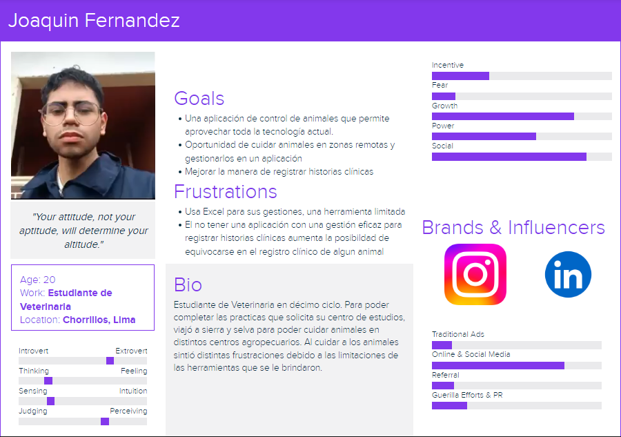

# Capítulo II: Requirements Elicitation & Analysis
## 2.1. Competidores

### 2.1.1. Análisis competitivo
<table>
  <tr>
    <th colspan="7" valign="top"><b>Competitive Analysis Landscape</b></th>
  </tr>
  <tr>
    <td colspan="2" rowspan="2">¿Por qué llevar a cabo este análisis?</td>
    <td colspan="5">Este análisis es vital para identificar cómo tu startup puede diferenciarse en un mercado competitivo, permitiéndote ofrecer una solución más efectiva y destacada en la gestión y prevención de problemas de salud animal</td>
  </tr>
  <tr>
    <td colspan="5">.</td>
  </tr>
  <tr>
    <td colspan="3">(En la cabecera colocar por cada competidor nombre y logo)</td>
    <td colspan="1" valign="top" style="font-weight: bold;">
        DevDream
         
        

                
        

    <td colspan="1" valign="top" style="font-weight: bold;">
    FarmLogs
    

                
        

    </td>
    <td colspan="1" valign="top" style="font-weight: bold;">
      Herdwatch
      

                
            

      </td>
    <td colspan="1" valign="top" style="font-weight: bold;" >
      AgriWebb
      

                
            

    </td>
  </tr>
  <tr>
    <td colspan="1" rowspan="2">
Perfil
</td>
    <td colspan="2">Overview</td>
    <td colspan="1" valign="top">DevDream está enfocada en el sector veterinario y ganadero, proporcionando un software que facilita el control de la salud de los animales, evitando la pérdida de información crítica, la duplicación de datos y la omisión de tratamientos, lo que puede causar problemas de salud y pérdidas económicas.</td>
    <td colspan="1" valign="top">FarmLogs es una plataforma digital para la gestión agrícola, que permite a los agricultores monitorear cultivos, suelos y recursos, optimizando sus operaciones</td>
    <td colspan="1" valign="top">Herdwatch es una aplicación enfocada en la gestión de granjas, diseñada para rastrear la salud y productividad del ganado, cumpliendo con las regulaciones del sector</td>
    <td colspan="1" valign="top">AgriWebb proporciona un software de gestión de ganado con un fuerte enfoque en la trazabilidad, productividad y bienestar animal, utilizando datos en tiempo real para mejorar las decisiones agrícolas</td>
  </tr>
  <tr>
    <td colspan="2">Ventaja competitiva</td>
    <td colspan="1" valign="top">Nuestra solucion se destaca por su enfoque integral en la prevención y el monitoreo continuo de la salud animal, asegurando que toda la información esté centralizada y actualizada en tiempo real, lo que minimiza riesgos y optimiza la gestión</td>
    <td colspan="1" valign="top">Su enfoque en la gestión integral de recursos agrícolas lo convierte en una herramienta poderosa para operaciones más grandes que requieren un control total sobre sus cultivos y suelos</td>
    <td colspan="1" valign="top">Su mayor fortaleza es la conformidad regulatoria, permitiendo a los agricultores cumplir fácilmente con las normativas, mientras optimizan la eficiencia operativa y aseguran una trazabilidad completa del ganado</td>
    <td colspan="1" valign="top">Su ventaja competitiva radica en la trazabilidad y optimización de la producción, ayudando a los agricultores a maximizar la eficiencia y mejorar la salud y productividad del ganado</td>
  </tr>
  <tr>
    <td colspan="1" rowspan="2">
Perfil de Marketing
</td>
    <td colspan="2">Mercado objetivo</td>
    <td colspan="1" valign="top">DevDream se enfoca en veterinarias y granjas que necesitan una solución efectiva para el monitoreo y control de la salud de sus animales, así como en productores agropecuarios que buscan digitalizar sus procesos.</td>
    <td colspan="1" valign="top">FarmLogs se dirige a grandes operaciones agrícolas y agricultores que buscan optimizar la gestión de sus cultivos y recursos agrícolas</td>
    <td colspan="1" valign="top">Herdwatch se enfoca en agricultores y veterinarios que requieren un sistema eficaz para el seguimiento de la salud y la productividad del ganado</td>
    <td colspan="1" valign="top">AgriWebb se dirige a agricultores que buscan optimizar la trazabilidad, productividad y bienestar del ganado a través de una plataforma digital.</td>
  </tr>
  <tr>
    <td colspan="2">Estrategias de marketing</td>
    <td colspan="1" valign="top"> La estrategia incluye campañas educativas y de capacitación, marketing digital en redes sociales, y alianzas con asociaciones del sector veterinario y ganadero</td>
    <td colspan="1" valign="top">FarmLogs utiliza marketing digital enfocado en contenido educativo sobre eficiencia agrícola y productividad, además de realizar alianzas con grandes distribuidores de productos agrícolas</td>
    <td colspan="1" valign="top">Herdwatch utiliza campañas dirigidas a través de asociaciones agrícolas y veterinarias, destacando su conformidad con normativas y su facilidad de uso</td>
    <td colspan="1" valign="top">AgriWebb se enfoca en marketing digital dirigido, destacando casos de éxito y la optimización de la producción como sus principales atractivos</td>
  </tr>
  <tr>
    <td colspan="1" rowspan="3">
Perfil de Producto
</td>
    <td colspan="2">Productos & Servicios</td>
    <td colspan="1" valign="top">Ofrece un software integral para la gestión de la salud animal, con seguimiento de tratamientos, vacunaciones y monitoreo en tiempo real, junto con soporte técnico continuo y actualizaciones regulares.</td>
    <td colspan="1" valign="top">Ofrece una plataforma integral para el monitoreo de cultivos, gestión de suelos y recursos, incluyendo herramientas de planificación y análisis agrícola.</td>
    <td colspan="1" valign="top">Proporciona una aplicación que permite el registro y monitoreo del ganado, facilitando el cumplimiento de normativas y optimizando la productividad.</td>
    <td colspan="1" valign="top">Ofrece un software de gestión de ganado que permite a los agricultores rastrear y optimizar cada aspecto de la producción ganadera</td>
  </tr>
  <tr>
    <td colspan="2">Precios & Costos</td>
    <td colspan="1" valign="top">Modelo freemium con una versión básica gratuita y una membresía premium que desbloquea todas las funcionalidades avanzadas, disponible con planes mensuales o anuales.</td>
    <td colspan="1" valign="top">Funciona bajo un modelo de suscripción, con diferentes niveles de servicio dependiendo del tamaño de la operación agrícola y las funcionalidades requeridas.</td>
    <td colspan="1" valign="top">Ofrece un modelo de suscripción con diferentes planes basados en la cantidad de ganado y las necesidades específicas de la granja.</td>
    <td colspan="1" valign="top">Funciona bajo un modelo de suscripción, con planes que varían según la cantidad de ganado y las funcionalidades adicionales requeridas</td>
  </tr>
  <tr>
    <td colspan="2">Canales de distribución (Web y/o Móvil)</td>
    <td colspan="1" valign="top">La plataforma está disponible tanto en web como en dispositivos móviles, garantizando accesibilidad y monitoreo desde cualquier lugar.</td>
    <td colspan="1" valign="top">Disponible tanto en web como en dispositivos móviles, permitiendo a los agricultores acceder a sus datos y gestionar sus operaciones desde cualquier lugar.</td>
    <td colspan="1" valign="top">Disponible tanto en web como en aplicaciones móviles, lo que permite a los usuarios registrar datos y monitorear el ganado en tiempo real desde cualquier lugar.</td>
    <td colspan="1" valign="top">Disponible en plataformas web y móviles, asegurando que los agricultores puedan gestionar sus operaciones ganaderas en tiempo real desde cualquier dispositivo.</td>
  </tr>
  <tr>
    <td colspan="1" rowspan="5">
Análisis SWOT
</td>
    <td colspan="6">Realice esto para su startup y sus competidores. Sus fortalezas deberían apoyar sus oportunidades y contribuir a lo que ustedes definen como su posible ventaja competitiva.</td>
  </tr>
  <tr>
    <td colspan="2">Fortalezas</td>
    <td colspan="1" valign="top">Integración total de datos en tiempo real, enfoque preventivo para evitar problemas de salud animal, y accesibilidad desde múltiples dispositivos.</td>
    <td colspan="1" valign="top">Su enfoque integral en la gestión de recursos agrícolas y su capacidad para ofrecer análisis avanzados hacen de FarmLogs una herramienta poderosa para grandes agricultores</td>
    <td colspan="1" valign="top">Su capacidad para asegurar la conformidad regulatoria y su enfoque en la trazabilidad lo hace indispensable para granjas que necesitan cumplir con estrictas normativas.</td>
    <td colspan="1" valign="top">Su enfoque en la trazabilidad y la optimización de la producción permite a los usuarios maximizar la eficiencia y la rentabilidad de sus operaciones ganaderas</td>
  </tr>
  <tr>
    <td colspan="2">Debilidades</td>
    <td colspan="1" valign="top">Falta de reconocimiento inicial en el mercado y una posible curva de aprendizaje para usuarios menos familiarizados con la tecnología</td>
    <td colspan="1" valign="top">Puede no ser la mejor opción para pequeñas granjas o operaciones que se centran exclusivamente en la ganadería.</td>
    <td colspan="1" valign="top">Puede ser menos atractivo para agricultores que buscan una solución más completa que incluya otros aspectos de la gestión agrícola</td>
    <td colspan="1" valign="top">Puede ser menos útil para agricultores que buscan una solución más amplia que incluya la gestión de cultivos o recursos agrícolas además del ganado</td>
  </tr>
  <tr>
    <td colspan="2">Oportunidades</td>
    <td colspan="1" valign="top">Creciente digitalización en el sector agropecuario y posibilidad de expansión internacional en mercados con necesidades similares</td>
    <td colspan="1" valign="top">Expansión en mercados internacionales con un enfoque en la agricultura de precisión y la adopción de tecnologías avanzadas</td>
    <td colspan="1" valign="top">Expansión en mercados donde las regulaciones son estrictas, pero la adopción tecnológica es baja, lo que crea una gran necesidad de soluciones como Herdwatch.</td>
    <td colspan="1" valign="top">Adopción en mercados emergentes donde la trazabilidad del ganado se está volviendo un requisito esencial, pero las herramientas tecnológicas aún son limitadas.</td>
  </tr>
  <tr>
    <td colspan="2">Amenazas</td>
    <td colspan="1" valign="top">Competidores que ofrecen soluciones más integradas que combinan el manejo de ganado con otras funciones agrícolas</td>
    <td colspan="1" valign="top">Competencia de otras plataformas de gestión agrícola que ofrecen herramientas más específicas para el manejo de ganado o integraciones más profundas con maquinaria agrícola</td>
    <td colspan="1" valign="top">Competidores que ofrecen soluciones más integradas que combinan el manejo de ganado con otras funciones agrícolas</td>
    <td colspan="1" valign="top">Competencia de soluciones más generalizadas que ofrecen una gama más amplia de funcionalidades, incluyendo la integración de cultivos y gestión de recursos.</td>
  </tr>
</table>

### 2.1.2. Estrategias y tácticas frente a competidores

- *Diferenciación de la plataforma:* 
#### Ofrecer funcionalidades específicas para la gestión y monitoreo detallado de la salud animal, como alertas personalizadas para tratamientos y vacunas, así como integración con dispositivos de monitoreo en tiempo real. Esto permitirá a la startup destacarse frente a competidores que pueden tener un enfoque más generalista o menos especializado en ganadería.
- *Comunidad activa:* 
#### Construir y fomentar una comunidad de usuarios mediante foros en línea, grupos en redes sociales y eventos educativos. Promover la interacción entre usuarios para compartir mejores prácticas y experiencias puede mejorar la fidelidad y el compromiso, al mismo tiempo que proporciona retroalimentación valiosa para el desarrollo continuo del producto.
- *Marketing dirigido:* 
#### Implementar campañas de marketing dirigidas a productores agropecuarios específicos y veterinarios mediante la segmentación en redes sociales, publicaciones en revistas especializadas y asistencia a eventos del sector. Aprovechar los datos demográficos y las necesidades específicas del mercado objetivo para diseñar mensajes personalizados y efectivos.
- *Monetización creativa:*
#### Ofrecer un modelo de suscripción con diferentes niveles de membresía que proporcionen acceso a funciones exclusivas, soporte prioritario y capacitación adicional. Además, explorar opciones como servicios de consultoría personalizada o módulos adicionales que puedan ser adquiridos a la carta, brindando flexibilidad y valor añadido a los clientes.
## 2.2. Entrevistas
### 2.2.1. Diseño de entrevistas
En esta sección se han definido todas las preguntas que se plantearan en el momento de
realizar las preguntas a los diferentes segmentos objetivos

*Preguntas generales:*

1. ¿Cuál es tu nombre?
2. ¿Qué edad tienes?
3. ¿Dónde vives actualmente?
4. ¿A qué te dedicas?
5. ¿Que navegador usas en tu dia a dia?

*Preguntas Segmento 1: Cuidadores de animales en terrenos de productores agropecuarios*

1. ¿Que disposititvo tecnologico usabas para desempeñar tu trabajo?

1. ¿Que redes usas como profesional?

1. ¿Que tipo de sistema usas para administrar la salud de los animales a tu cuidado?

1. ¿Consideras que la calidad de tu productos mejoraria si implementaras una solucion tecnologica en el cuidado de tus animales?

1. ¿Consideras que la tecnologia actual podria mejorar el monitoreo de la salud de los animales? ¿Usarias una tecnologia para el monitoreo y registro de la salud de tus animales? 

1. ¿Cuales son los principales desafios al monitorear el estado de los animales?

1. ¿Qué te motivaría a probar o implementar una nueva herramienta tecnológica en tu trabajo?

*Preguntas Segmento 2: Veterinarias*

1. ¿Que disposititvo tecnologico usabas para desempeñar tu trabajo?

1. ¿Que tipo de sistema usas para administrar la salud de los animales a tu cuidado?

1. ¿Que te motiva a cuidar la salud de los animales?

1. ¿Alguna vez tuviste un error al llevar el registro de una mascota? ¿Cual fue el problema?

1. ¿Consideras que la tecnologia actual podria mejorar el monitoreo de la salud de los animales? ¿Usarias una tecnologia para el monitoreo y registro de la salud de tus animales?

1. ¿Que redes usas como profesional?

### 2.2.2 Registro de entrevistas.

*Segmento 1: Cuidadores de animales en terrenos de productores agropecuarios*

*Entrevista 1:*

Nombres: Joaquin

Apellidos: Fernandez

Edad: 20

Lugar de residencia: Chorrillos

Evidencia de la entrevista:

[Entrevista a Joaquin Fernandez - Estudiante de Veterinaria](https://drive.google.com/file/d/1RbRsImuD0NQTC3V6GTRcPB1UlGM2D4Qm/view?usp=sharing)

Resumen de la entrevista: Como cuidador en una granja con animales que se encontraba en la sierra, el entrevistado utilizaba Excel para administrar las distintas categorías del análisis de los animales que cuidaba. Considera que la tecnología actual tiene un gran potencial pero no está siendo aprovechada, por lo que sugiere que se pueden crear aplicaciones que permita rastrear actividad, monitoreo constante, un collar sensorial, entre otros. Todas las sugerencias dadas por el entrevistado se dan debido a que en una anterior oportunidad ha cometido errores debido a las limitadas herramientas a las que tiene acceso a pesar de tener al alcance dispositivos tecnológicos modernos, por lo que busca una aplicación que aproveche todo el potencial de la tecnología actual.

*Entrevista 2:*

Nombres:

Apellidos:

Edad:
Lugar de residencia:

Evidencia de la entrevista:

Enlace de la entrevista:

Resumen de la entrevista:

 

*Segmento 2: Veterinarias*

*Entrevista 1:*

Nombres: Joaquin

Apellidos: Fernandez

Edad: 20

Lugar de residencia: Chorrillos

Evidencia de la entrevista:

[Entrevista a Joaquin Fernandez - Estudiante de Veterinaria](https://drive.google.com/file/d/1RbRsImuD0NQTC3V6GTRcPB1UlGM2D4Qm/view?usp=sharing)

Resumen de la entrevista: Como veterinario, él utiliza Linkedin para tener una mayor conexión con otros veterinarios. Asegura que la tecnología actual debería permitir que los animales en zonas remotas también tengan un control en las veterinarias. Indica que ha tenido errores en las historias clínicas debido a disintos errores humanos que se podrían perfeccionar con alguna aplicación innovadora de control de animales.

*Entrevista 2:*

Nombre:

Apellido:

Edad:

Lugar de residencia:

Entrevistador:

Evidencia de la entrevista:

Enlace de entrevista:

Resumen de la entrevista:

 

### 2.2.3 Análisis de entrevistas.
<TABLE BORDER>
	<TR>
		<TD COLSPAN = 2 align=center>

*Características*</TD>

<TD align=center>

*Segmento1*</TD>

<TD align=center>

*Segmento2*</TD>

   </TR>
	<TR>
		<TD ROWSPAN = 4>

*Objetivas*
</TD>
<TD>.</TD>
<TD>.</TD>
<TD>.</TD>
</TR>
<TR>
<TD>.</TD>
<TD>.</TD>
<TD>.</TD>
</TR>
<TR>
<TD>.</TD>
<TD>.</TD>
<TD>.</TD>
</TR>
<TR>
<TD >.</TD>
<TD>.</TD>
<TD>.</TD>
</TR>

   <TR>
		<TD ROWSPAN = 4>

*Subjetivas*
</TD>
<TD>.</TD>
<TD>.</TD>
<TD>.</TD>
<TR>
<TD>.</TD>
<TD>.</TD>
<TD>.</TD>
</TR>
<TR>
<TD>.</TD>
<TD>.</TD>
<TD>.</TD>
</TR>
<TR>
<TD>.</TD>
<TD>.</TD>
<TD>.</TD>
</TR>
</TABLE>

## 2.3. Needfinding
### 2.3.1. User Personas
Se realiza un análisis de las respuestas brindadas por nuestros entrevistados, dividiéndose en los 2 segmentos definidos anteriormente por el equipo de trabajo.

*SEGMENTO 1: Cuidadores de animales en terrenos de productores agropecuarios*
  

*SEGMENTO 2: Veterinarias*

  

### 2.3.2. User Task Matrix

A continuación se pueden apreciar los User Task Matrix de los segmentos objetivos.

<table align="center" border="1" width="90%" style="text-align:center;">
    <tr>
        <td></td>
        <td colspan=2>
            <b>User Persona</b>
        </td>
    </tr>
    <tr>
        <td></td>
        <td colspan=2>
            Segmento Objetivo:   <b></b> 
        </td>
    </tr>
    <tr>
        <td>
            <b>Task</b>
        </td>
        <td>
            <b>Frequency</b>
        </td>
        <td>
            <b>Importance</b>
        </td>
    </tr>
    <tr>
        <td>
            .
        </td>
        <td>
            High
        </td>
        <td>
            High
        </td>
    </tr>
    <tr>
        <td>
            .
        </td>
        <td>
            Medium
        </td>
        <td>
            Medium
        </td>
    </tr>
    <tr>
        <td>
            .
        </td>
        <td>
            Medium
        </td>
        <td>
            High
        </td>
    </tr>
    <tr>
        <td>
            .
        </td>
        <td>
            High
        </td>
        <td>
            High
        </td>
    </tr>
    <tr>
        <td>
            .
        </td>
        <td>
            Low
        </td>
        <td>
            Medium
        </td>
    </tr>
    <tr>
        <td>
            .
        </td>
        <td>
            Medium
        </td>
        <td>
            High
        </td>
    </tr>
    <tr>
        <td>
            .
        </td>
        <td>
            Low
        </td>
        <td>
            Medium
        </td>
    </tr>
</table>

  

<table align="center" border="1" width="90%" style="text-align:center;">
    <tr>
        <td></td>
        <td colspan=2>
            <b>User Persona</b>
        </td>
    </tr>
    <tr>
        <td></td>
        <td colspan=2>
            Segmento Objetivo:   <b></b>  
        </td>
    </tr>
    <tr>
        <td>
            <b>Task</b>
        </td>
        <td>
            <b>Frequency</b>
        </td>
        <td>
            <b>Importance</b>
        </td>
    </tr>
    <tr>
        <td>
            .
        </td>
        <td>
            High
        </td>
        <td>
            High
        </td>
    </tr>
    <tr>
        <td>
            .
        </td>
        <td>
            High
        </td>
        <td>
            High
        </td>
    </tr>
    <tr>
        <td>
            .
        </td>
        <td>
            Medium
        </td>
        <td>
            Medium
        </td>
    </tr>
    <tr>
        <td>
            .	
        </td>
        <td>
            High
        </td>
        <td>
            High
        </td>
    </tr>
    <tr>
        <td>
            .
        </td>
        <td>
            Medium
        </td>
        <td>
            High
        </td>
    </tr>
    <tr>
        <td>
            .
        </td>
        <td>
            Low
        </td>
        <td>
            Medium
        </td>
    </tr>
    <tr>
        <td>
            .
        </td>
        <td>
            Medium
        </td>
        <td>
            High
        </td>
    </tr>
</table>

  

### 2.3.3. User Journey Mapping

A continuación se pueden apreciar los User Journey Mapping de los segmentos objetivos.

*SEGMENTO 1*

*SEGMENTO 2*

### 2.3.4. Empathy Mapping

A continuación se pueden apreciar los Empathy Mapping de los segmentos objetivos.

*SEGMENTO 1*

*SEGMENTO 2*

### 2.3.5. As-is Scenario Mapping

A continuación se pueden apreciar los As-Is Scenario de los segmentos objetivos.

*SEGMENTO 1*

*SEGMENTO 2*

*Enlace de Miro:*

## 2.4. Ubiquitous Language
