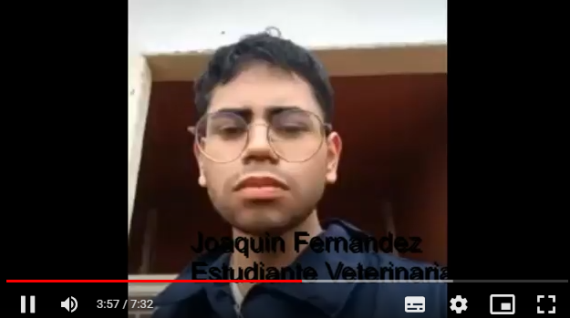

<div align="center">

# Universidad Peruana De Ciencias Aplicadas
## Carrera de Ingeniería de Software
## Desarrollo de Aplicaciones Web


</div>

<p align = "center"> </img> </p>

<div align="center">

# Informe TB3
### **Profesor: Juan Carlos Tinoco Licas**
#### **Startup: DevDream**
#### **Producto: FarmGuard**

#### Sección: SW51

|           Integrantes            |   Código   |
|:--------------------------------:|:----------:|
|   Morales Quispe, Brayan Smith   | U20211F984 |
|   Donayre Paredes, Luis Carlos   | U202115920 |
| Lopez de la Cruz ,Mauro Fabricio | U202215695 |
| David Polanco, Alessandro Alonso | U202122232 |
|   Cusimayta Lobo, Alex Gabriel   | U202019131 |

#### Noviembre 2024
</div>

# **Registro de Versiones Del Informe**
<table>
  <thead>
    <tr>
        <th>Versión</th>
        <th>Fecha</th>
        <th>Autor</th>
        <th>Descripción de modificación</th>
    </tr>
  </thead>
  <tbody>
  <tr>
      <td><strong>1.0</strong></td>
      <td>24/08/24</td>
      <td>
        <ul>
          <li>Morales Quispe, Brayan Smith</li>
          <li>David Polanco, Alessandro Alonso</li>
          <li>Donayre Paredes, Luis Carlos</li>
        </ul>
      </td>
      <td>
        Se incluyeron los siguientes capítulos:
        <ul>
          <li>Estructura del informe</li>
          <li>Capítulo I: Introducción</li>
          <li>Capítulo II: Requirements Elicitation & Analysis</li>
          <li>Capítulo III: Requirements Specification</li>
          <li>Capítulo IV: Product Design</li>
          <li>Capítulo V: Product Implementation, Validation & Deployment</li>
          <li>Landing Page</li>
        </ul>
      </td>
  </tr>

  <tr>
      <td><strong>2.0</strong></td>
      <td>15/09/24</td>
      <td>
        <ul>
          <li>Morales Quispe, Brayan Smith</li>
          <li>David Polanco, Alessandro Alonso</li>
          <li>Donayre Paredes, Luis Carlos</li>
        </ul>
      </td>
      <td>
        Se incluyeron los siguientes capítulos:
        <ul>
          <li>sprint 2</li>
          <li>Despliege del frontend</li>
          <li>Despliege del fake service</li>
        </ul>
      </td>
  </tr>

  <tr>
      <td><strong>3.0</strong></td>
      <td>31/10/24</td>
      <td>
        <ul>
          <li>Morales Quispe, Brayan Smith</li>
          <li>David Polanco, Alessandro Alonso</li>
        </ul>
      </td>
      <td>
        Se incluyeron los siguientes capítulos:
        <ul>
          <li>sprint 3</li>
          <li>Despliege de la base de datos</li>
          <li>Despliege del frontend</li>
          <li>Realizacion de la entrevistas</li>
          <li>Evaluacion de euristicas</li>
        </ul>
      </td>
  </tr>
  </tbody>
</table>

# **Student Outcomes**

<table>
  <thead>
    <tr>
        <th>Criterio especifico</th>
        <th>Acciones realizadas</th>
        <th>Conclusiones</th>
    </tr>
  </thead>
  <tbody>
  <tr>
      <td><strong>Trabaja en equipo para 
      proporcionar liderazgo en 
      forma conjunta</strong></td>
      <td>
      <h6>Brayan Smith Morales Quispe</h6>TB1:<p>Ayude a organizar y repartir temas a  cada miembro del equipo aparte q ayude cualquier duda de mis compañeros respecto al trabajo.</p>TP:<p>En esta entrega ayude a desarrollar el sprint 2. Ademas de la creacion de un grupo de discord para mejorar la comunicacion del equipo.</p> TB3:<p>En esta entrega ayude a mis compañéros con problemas al desarrollar la backend ademas de organizar la estructura del desarrollo</p>
      <h6>Alessandro Alonso David Polanco</h6>TB1:<p>Aporté al grupo organizando los capítulos y lo que se debía hacer para cada capítulo, a la vez que aporte en el capítulo 2 con el as is scenario, y el ubiquitous language, aparte mi mayor aporte fue en el landing page haciendo varias secciones de el mismo.</p> 
      TP:<p>Aporté al grupo organizando los capítulos y lo que se debía hacer para cada capítulo, mi aporte para este capitulo fue en la documentacion del Capitulo V y realizar el componente "UserProfile" y "Notifications" del frontend de nuestro Web App FarmGuard. </p>
      <h6>Donayre Paredes, Luis Carlos</h6>TB1:<p>Realizó parte del informe, entrevistó a un posible usuario y participó del video del equipo</p>
      <h6>Lopez de la Cruz ,Mauro Fabricio</h6>TB1:<p>Desde el inicio designamos tareas de manera equitativa teniendo en mente la opinión de todos los integrantes. Esto mismo ha hecho para reforzar el compañerismo y trabajo justo y para crear una buena base de Trabajo
        </p>TP:<p>Trabajamos como equipo para tener en en claro la línea de guía para realizar ese trabajo. De tal modo que todos estemos contentos con el resultado final</p> 
      </td>
      <td>TB1: En conclucion la realizacion de este informe no fue facil puesto que el equipo no se comunica. En este punto se entiende el ambiente, dado que cada miembro recien se esta conociendo. <p>TP: En conclucion la comunicacion mejoro respecto a la primera entrega se utilizo mas medios de comunicacion como discord que ayudaron a mejorar algunos puntos del informe.</p>
      </td>
  </tr>
   <tr>
      <td><strong>Crea un entorno colaborativo e 
      inclusivo, establece metas, planifica tareas 
      y cumple objetivos </strong></td>
      <td>
      <h6>Brayan Smith Morales Quispe</h6>TB1:<p>Como grupo nos establecimos metas claras hacia donde va nuestro trabajo, la planificacion considero que fue regular puesto que no todo el equipo tiene el tiempo para realizar juntas mas seguidas.</p>TP:<p>Ayude a distribuir y apoyar a mis compañéros en el avanze del desarrollo del frontend.</p> TB3:<p>Se busco un avanze en la union del grupo buscando compartir nuestras ideas y ayudarnos entre nosotros por la plataforma de discord.</p>
      <h6>Alessandro Alonso David Polanco</h6>TB1:<p>Desde el principio sabiamos el tema que ibamos a escoger y el enfoque que ibamos a tomar relacionado al mismo, hubo colaboración constante, sin embargo creo que se debería mejorar más en la planificación de reuniones para revisar avances y mejoras</p> 
      <h6>Donayre Paredes, Luis Carlos</h6>TB1:<p>Al entrevistar, se hallaron varios problemas solucionables con nuestra aplicación. Además, se expuso parte del informe en el video</p> 
      </td>
      <td>TB1:En conclucion aun el trabajo en equipo esta un distante y se nota en la falta de comunicacion en algunos apartados del informe<p>TP:En conclucion el entorno del equipo mejoro respecto al anterior entregable puesto que hubo mas comuniacion por llamadas de voz y compartiendo nuestros conocimientos entre nosotros.</p></td>
  </tr>

  </tbody>
</table>

# Project Report Collaboration Insights 

**Link del repositorio-Informe:** [https://github.com/DevDream-UPC/Project-Report](https://github.com/DevDream-UPC/Project-Report)

**Link de los repositorios de la oraganización:** [https://github.com/DevDream-UPC](https://github.com/DevDream-UPC)

Ahora veremos el diagrama de barras que representara la cantidad de commits realizados por el equipo de trabajo.


A continuacion se mostrara un linea de tiempo con flujo de los commits realizados por cada miembro del equipo en un intervalo de tiempo.


# Contenido

- [Contenido](#contenido)
- [**Capítulo I: Introducción.**](#capítulo-i-introducción)
  - [**1.1  Startup Profile.**](#11--startup-profile)
    - [**1.1.1. Descripción del startup.**](#111-descripción-del-startup)
    - [**1.1.2.  Perfiles de los integrantes del equipo.**](#112--perfiles-de-los-integrantes-del-equipo)
  - [**1.2. Solution Profile.**](#12-solution-profile)
    - [**1.2.1. Antecedentes y Problemática.**](#121-antecedentes-y-problemática)
    - [**1.2.2. Lean UX Process.**](#122-lean-ux-process)
      - [**1.2.2.1. Lean UX Problem Statements.**](#1221-lean-ux-problem-statements)
      - [**1.2.2.2. Lean UX Assumptions.**](#1222-lean-ux-assumptions)
      - [**1.2.2.3. Lean UX Hypothesis Statements.**](#1223-lean-ux-hypothesis-statements)
      - [**1.2.2.4. Lean UX Canvas.**](#1224-lean-ux-canvas)
  - [**1.3. Segmentos objetivo.**](#13-segmentos-objetivo)
- [**Capítulo II: Requirements Elicitation \& Analysis**](#capítulo-ii-requirements-elicitation--analysis)
  - [**2.1. Competidores.**](#21-competidores)
    - [**2.1.1. Análisis competitivo.**](#211-análisis-competitivo)
    - [**2.1.2. Estrategias y tácticas frente a competidores.**](#212-estrategias-y-tácticas-frente-a-competidores)
  - [**2.2. Entrevistas.**](#22-entrevistas)
    - [**2.2.1. Diseño de entrevistas.**](#221-diseño-de-entrevistas)
    - [**2.2.2. Registro de entrevistas.**](#222-registro-de-entrevistas)
    - [**2.2.3. Análisis de entrevistas.**](#223-análisis-de-entrevistas)
  - [**2.3. Needfinding.**](#23-needfinding)
    - [**2.3.1. User Personas.**](#231-user-personas)
    - [**2.3.2. User Task Matrix.**](#232-user-task-matrix)
    - [**2.3.3. User Journey Mapping**](#233-user-journey-mapping)
    - [**2.3.4. Empathy Mapping**](#234-empathy-mapping)
    - [**2.3.5. As-is Scenario Mapping**](#235-as-is-scenario-mapping)
  - [**2.4. Ubiquitous Language**](#24-ubiquitous-language)
- [**Capítulo III: Requirements Specification.**](#capítulo-iii-requirements-specification)
  - [**3.1. To-Be Scenario Mapping.**](#31-to-be-scenario-mapping)
  - [**3.2.User Stories.**](#32user-stories)
  - [**3.3. Impact Mapping.**](#33-impact-mapping)
  - [**3.4. Product Backlog.**](#34-product-backlog)
- [**Capítulo IV: Product Design.**](#capítulo-iv-product-design)
  - [**4.1. Style Guidelines.**](#41-style-guidelines)
    - [**4.1.1. General Style Guidelines.**](#411-general-style-guidelines)
    - [**4.1.2. Web Style Guidelines.**](#412-web-style-guidelines)
  - [**4.2. Information Architecture.**](#42-information-architecture)
    - [**4.2.1. Organization Systems.**](#421-organization-systems)
    - [**4.2.2. Labeling Systems.**](#422-labeling-systems)
    - [**4.2.3. SEO Tags and Meta Tags.**](#423-seo-tags-and-meta-tags)
    - [**4.2.4. Searching Systems.**](#424-searching-systems)
    - [**4.2.5. Navigation Systems.**](#425-navigation-systems)
  - [**4.3. Landing Page UI Design**](#43-landing-page-ui-design)
    - [**4.3.1. Landing Page Wireframe.**](#431-landing-page-wireframe)
    - [**4.3.2. Landing Page Mock-up.**](#432-landing-page-mock-up)
  - [**4.4. Web Applications UX/UI Design.**](#44-web-applications-uxui-design)
    - [**4.4.1. Web Applications Wireframes.**](#441-web-applications-wireframes)
    - [**4.4.2. Web Applications Wireflow Diagrams.**](#442-web-applications-wireflow-diagrams)
    - [**4.4.3. Web Applications Mock-ups.**](#443-web-applications-mock-ups)
    - [**4.4.4. Web Applications User Flow Diagrams.**](#444-web-applications-user-flow-diagrams)
  - [**4.5. Web Applications Prototyping.**](#45-web-applications-prototyping)
  - [**4.6. Domain-Driven Software Architecture**](#46-domain-driven-software-architecture)
    - [**4.6.1. Software Architecture Context Diagram.**](#461-software-architecture-context-diagram)
    - [**4.6.2. Software Architecture Container Diagrams.**](#462-software-architecture-container-diagrams)
    - [**4.6.3. Software Architecture Components Diagrams.**](#463-software-architecture-components-diagrams)
  - [**4.7. Software Object-Oriented Design.**](#47-software-object-oriented-design)
    - [**4.7.1. Class Diagrams.**](#471-class-diagrams)
    - [**4.7.2. Class Dictionary.**](#472-class-dictionary)
  - [**4.8. Database Design.**](#48-database-design)
    - [**4.8.1. Database Diagram.**](#481-database-diagram)
- [**Capítulo V: Product Implementation, Validation \& Deployment.**](#capítulo-v-product-implementation-validation--deployment)
  - [**5.1. Software Configuration Management.**](#51-software-configuration-management)
    - [**5.1.1. Software Development Environment Configuration.**](#511-software-development-environment-configuration)
    - [**5.1.2. Source Code Management.**](#512-source-code-management)
    - [**5.1.3. Source Code Style Guide \& Conventions.**](#513-source-code-style-guide--conventions)
    - [**5.1.4. Software Deployment Configuration.**](#514-software-deployment-configuration)
  - [**5.2. Landing Page, Services \& Applications Implementation.**](#52-landing-page-services--applications-implementation)
    - [**5.2.1. Sprint 1.**](#521-sprint-1)
      - [**5.2.1.1. Sprint Planning 1.**](#5211-sprint-planning-1)
      - [**5.2.1.2. Sprint Backlog 1.**](#5212-sprint-backlog-1)
      - [**5.2.1.3. Development Evidence for Sprint Review.**](#5213-development-evidence-for-sprint-review)
      - [**5.2.1.4. Testing Suite Evidence for Sprint Review.**](#5214-testing-suite-evidence-for-sprint-review)
      - [**5.2.1.5. Execution Evidence for Sprint Review.**](#5215-execution-evidence-for-sprint-review)
      - [**5.2.1.6. Services Documentation Evidence for Sprint Review.**](#5216-services-documentation-evidence-for-sprint-review)
      - [**5.2.1.7. Software Deployment Evidence for Sprint Review.**](#5217-software-deployment-evidence-for-sprint-review)
      - [**5.2.1.8. Team Collaboration Insights during Sprint.**](#5218-team-collaboration-insights-during-sprint)
      - [**5.2.2 Sprint 2.**](#522-sprint-2)
      - [**5.2.2.1. Sprint Planning 2.**](#5221-sprint-planning-2)
      - [**5.2.2.2. Sprint Backlog 2.**](#5222-sprint-backlog-2)
      - [**5.2.2.3. Development Evidence for Sprint Review.**](#5223-development-evidence-for-sprint-review)
      - [**5.2.2.4. Testing Suite Evidence for Sprint Review.**](#5224-testing-suite-evidence-for-sprint-review)
      - [**5.2.2.5. Execution Evidence for Sprint Review.**](#5225-execution-evidence-for-sprint-review)
      - [**5.2.2.6. Services Documentation Evidence for Sprint Review.**](#5226-services-documentation-evidence-for-sprint-review)
      - [**5.2.2.7. Software Deployment Evidence for Sprint Review.**](#5227-software-deployment-evidence-for-sprint-review)
      - [**5.2.2.8. Team Collaboration Insights during Sprint.**](#5228-team-collaboration-insights-during-sprint)

# Capítulo I: Introducción
## 1.1. Startup Profile
### 1.1.1. Descripción de la Startup

DevDream es un startup dedicada al desarrollo de software resaltando su caracteristica de busqueda de soluciones creativas a los diferentes desafios.
Fundado por estudiantes de la Universidad Peruana de Ciencias Aplicadas (UPC), buscamos un enfoque orientado en las necesidades de nuestros clientes y con un trabajo en estrecha colaboracion.

 * __Mision:__ Nuestra mision es desarrollar soluciones tecnologicas innovadoras que aborden y resuelvan los desafios actuales.

* __Vision:__ Nuestra vision es contribuir al progreso tecnologico y ser socios de empresas que buscan impactar en el mundo con soluciones sustentables. 

### 1.1.2. Perfiles de integrantes del equipo

| **Integrantes**                              | **Descripción**                                                                                                                                                                                   | **Conocimientos**                                                                                                                    |
|----------------------------------------------|---------------------------------------------------------------------------------------------------------------------------------------------------------------------------------------------------|--------------------------------------------------------------------------------------------------------------------------------------|
| Brayan Smith Morales Quispe (U20211F984)     | Soy Brayan Smith tengo 21 años soy de Ingeniería de Software escogí esta carrera porque me gusta los videojuegos y el desarrollo de aplicaciones                                                  | Nivel Intermedio en C++ y C#. Nivel básico SQL. Nivel Intermedio Ilustrator y Photoshop,Nivel intermedio en Angular y Java, C# y .net |
| Mauro Fabricio Lopez de la Cruz (U202215695) | Soy Fabricio Lopez estudio la ccarrera de Ingeneria de Software , escogi esta carrera porque desde pequeño siempre me ha llamado la atencion como es el desarrollo web ,movil y la ciberseguridad | Nivel intermedio de SQL y Python. Nivel basico de Angular,Java ,C# ,.net                                                             |
| Luis Carlos Donayre Paredes (U202115920)     | Soy Luis Carlos, tengo 20 años y estudio Ing. de Software. Escogí esta carrear porque de pequeño me apasionaba la informática y de mayor me encantó la programación.                              | Nivel Intermedio en C++. Nivel básico SQL. Nivel Intermedio Photoshop                                                                |
| Alex Gabriel Cusimayta Lobo (U202019131)     | Soy Alex Gabriel, tengo 21 años y estudio Ing. de Software. Escogí esta carrear porque siempre me gusto la tecnologia, los juegos y la programacion.                                              | Nivel Intermedio en C++, Python, JavaScript y manejo de bases de datos de tipo SQL y NoSQL                                           |

## 1.2. Solution Profile
### 1.2.1 Antecedentes y problemática

### Descripcion de la problematica
Nuestro software esta enfocado en el sector veterinario y ganadero, este busca facilitar el control de estado de los animales en los diferentes rubros mencionados, evitar el riesgo de perder informacion critica, duplicar informacion u omitir tratamientos, lo que puede provocar problemas de salud en los animales y generando perdidas economicas. 

#### Técnica de las 5 ‘W’s y 2 ‘H’s

#### What?

**¿Cuál es el problema?**

El problema identificado es la falta de un sistema que permita llevar un control total y en tiempo real de la salud de los animales. Esto provoca dificulta el seguimiento preciso del estado de cada animal, historial de vacunas y tratamientos médicos. Como resultado, los ganaderos y veterinarios enfrentan riesgos como la duplicación de información, administración de tratamientos incorrectos o innecesarios y la omision de tratamientos especiales, lo que compromete la salud de los animales


#### When?

**¿Cuándo sucede el problema?**

Sucede al momento que una veterinaria o granja requiere monitorear una cantidad grande o selecta de animales, sin tener que recurrir a documentos fisicos o digitales que hacen el monitoreo mas lento y menos eficaz.  


#### Where?


**¿Dónde surge el problema?**

El problema surge en granjas y veterinarias que manejan múltiples registros de animales y carecen de un sistema adecuado para gestionarlos de manera eficiente.

#### Who?

**¿Quiénes están involucrados?**

Los principales afectados son los dueños de granjas o veterinarios que manejan multiples registros de animales sobre su estado de salud en tiempo real.


#### Why?

**¿Cuál es la causa del problema?**

La causa del problema esta en la complejidad de gestionar múltiples registros y monitorear a un gran número de animales en diferentes granjas y veterinarias. Esto dificulta mantener un control preciso y actualizado del estado de salud de cada animal, lo que es esencial para garantizar su bienestar.

#### How?

**¿Como se lleva a cabo los hechos?**

Los hechos se desarrollan cuando se utilizan diferentes métodos desconectados entre si, como registros en papel, hojas de cálculo o software no integrado, para gestionar la información de los animales en granjas y veterinarias. Esta falta de integración provoca que los datos estén dispersos y no se comuniquen entre sí, lo que complica mantener un control preciso y actualizado del estado de salud de cada animal.

#### How much?

**¿Cual es la magnitud del problema?**
 

La magnitud del problema es grande, ya que afecta a la capacidad de la granjas y/o veterinarias para llevar un control sobre la salud de los animales. Que trae como consecuencia la baja salud de los animales, reduccion de productividad, incrementos de los costos, cumplimientos regulatorios de cada pais.


### 1.2.2 Lean UX Process.
#### 1.2.2.1. Lean UX Problem Statements.

Nuestro entorno evidencia problemas graves al llevar un registro de salud y monitoreo, sobre los animales que son parte de nuestra vida diaria como los domesticos atendidos en veterinarias y los de granjas.

Hemos observado un factor critico que afecta al control de la salud de los animales, el cual puede perjudicar tanto a los animales domesticos atendidos en veterinarias como animales de granjas. 

**¿Cómo pueden las veterinarias y granjas llevar a cabo un monitoreo y registro de salud adecuados y eficientes de los animales?**

#### 1.2.2.2. Lean UX Assumptions.
### Business Assumptions
* Los usuarios necesitan una aplicación del control de estado de una granja, que destaque por su seguridad y soporte técnico continuo.
* La principal necesidad de mis clientes es gestionar de manera eficaz y óptima los distintos procesos que se requieren para mantener una granja.
* La aplicación será redituable gracias a que existirá una membresía que mejora los tiempos de respuesta de soporte técnico y el acceso a la totalidad de las funciones de la aplicación sin ninguna restricción.
* A través de distintas estrategias de marketing obtendré distintos usuarios dispuestos a utilizar la aplicación.
* La aplicación será facil de utilizar para los usuarios ya que integrará una interfaz intuitiva y agradable a la vista.
### User Assumptions
* Los usuarios aceptarán compartir cierta cantidad de información fundamental para el correcto control de la granja dentro de la aplicación. 
* Los usuarios pagarán una membresía que mejora la experiencia en la aplicación al desbloquear todas las funciones disponibles.
* Los usuarios más fieles tendrán la oportunidad de acceder a nuevas funciones antes de ser publicadas en las versiones oficiales de la aplicación.
* Los usuarios entregrán su confianza a la aplicación para poder aprovecharla al máximo, utilizando las distintas características para la gestión segura, eficaz y óptima de sus granjas.
#### 1.2.2.3. Lean UX Hypothesis Statements.
* Si le ofrecemos una plataforma de control y gestión de granjas a usuuarios del sector interesados, podemos tener un grupo inicial de usuarios para poder experimentar nuevas funciones y brindarles beneficios exclusivos para fortalezar la fidelidad entre el usuario y nuestra startup.
* Si la membresía que ofrecemos contiene beneficios interesantes y atractivos, los usuarios accedarán a pagar la mensualidad a cambio de disfrutar de las funciones exclusivas.
* Si las decisiones de marketing son correctas, apropiadas y enfocadas en el sector correcto, el aumento de registros en la aplicación será mucho mayor a la prevista.
* Si el startup garantiza que la información de los usuarios estará encriptada y segura, la fidelidad de los usuarios aumentará. Como consecuencia, la aplicacion adquirirá una reputación positiva. 
#### 1.2.2.4. Lean UX Canvas.

## 1.3. Segmentos objetivo.

El primer segmento objetivo en el que la aplicación va a enfocarse es en productos agropecuarios dispuestos a gestionar sus granjas utilizando la aplicación de nuestra startup.

De la Encuesta Nacional Agropecuaria realizada en 2022 por el INEI a 32992 unidades agropecuarias, se conoce que el 59,8% es menor a 60 años, dando un margen importante de granjeros que posiblemente poseen conocimiento de las cualidades de los diversos dispositivos tecnológicos en la actualidad y tenga el interés de trasladar sus gestiones a medios digitales. De este grupo, el 6,6% de los productos agropecuarios especializados han recibido capacitación, por lo que la aplicación también puede servir como herramienta de aprendizaje para los productores interesados en aprender más tópicos fundamentales acerca de la gestión y control de crianza de animales.

El segundo segmento objetivo son las veterinarias de todo el país. La razón de esta elección es porque en el Perú existe un sistema deficiente del manejo de historias médicas, un documento totalmente determinante para la obtención y emisión de información de la salud de cualquier animal. En consecuencia, la desinformación en estos documentos fundamentales pueden perjudicar aún más la salud de animales que ya se encuentran padeciendo algun mal.

# Capítulo II: Requirements Elicitation & Analysis
## 2.1. Competidores

### 2.1.1. Análisis competitivo
<table>
  <tr>
    <th colspan="7" valign="top"><b>Competitive Analysis Landscape</b></th>
  </tr>
  <tr>
    <td colspan="2" rowspan="2">¿Por qué llevar a cabo este análisis?</td>
    <td colspan="5">Este análisis es vital para identificar cómo tu startup puede diferenciarse en un mercado competitivo, permitiéndote ofrecer una solución más efectiva y destacada en la gestión y prevención de problemas de salud animal</td>
  </tr>
  <tr>
    <td colspan="5">.</td>
  </tr>
  <tr>
    <td colspan="3">(En la cabecera colocar por cada competidor nombre y logo)</td>
    <td colspan="1" valign="top" style="font-weight: bold;">
        FarmGuard
        <br>
        <div style="text-align: center; margin-top: 10px;">
                
        </div>
    <td colspan="1" valign="top" style="font-weight: bold;">
    FarmLogs
    <div style="text-align: center; margin-top: 20px;">
                
        </div>
    </td>
    <td colspan="1" valign="top" style="font-weight: bold;">
      Herdwatch
      <div style="text-align: center; margin-top: 40px;">
                
            </div>
      </td>
    <td colspan="1" valign="top" style="font-weight: bold;" >
      AgriWebb
      <div style="text-align: center; margin-top: 20px;">
                
            </div>
    </td>
  </tr>
  <tr>
    <td colspan="1" rowspan="2"><p>Perfil</p></td>
    <td colspan="2">Overview</td>
    <td colspan="1" valign="top">DevDream está enfocada en el sector veterinario y ganadero, proporcionando un software que facilita el control de la salud de los animales, evitando la pérdida de información crítica, la duplicación de datos y la omisión de tratamientos, lo que puede causar problemas de salud y pérdidas económicas.</td>
    <td colspan="1" valign="top">FarmLogs es una plataforma digital para la gestión agrícola, que permite a los agricultores monitorear cultivos, suelos y recursos, optimizando sus operaciones</td>
    <td colspan="1" valign="top">Herdwatch es una aplicación enfocada en la gestión de granjas, diseñada para rastrear la salud y productividad del ganado, cumpliendo con las regulaciones del sector</td>
    <td colspan="1" valign="top">AgriWebb proporciona un software de gestión de ganado con un fuerte enfoque en la trazabilidad, productividad y bienestar animal, utilizando datos en tiempo real para mejorar las decisiones agrícolas</td>
  </tr>
  <tr>
    <td colspan="2">Ventaja competitiva</td>
    <td colspan="1" valign="top">Nuestra solucion se destaca por su enfoque integral en la prevención y el monitoreo continuo de la salud animal, asegurando que toda la información esté centralizada y actualizada en tiempo real, lo que minimiza riesgos y optimiza la gestión</td>
    <td colspan="1" valign="top">Su enfoque en la gestión integral de recursos agrícolas lo convierte en una herramienta poderosa para operaciones más grandes que requieren un control total sobre sus cultivos y suelos</td>
    <td colspan="1" valign="top">Su mayor fortaleza es la conformidad regulatoria, permitiendo a los agricultores cumplir fácilmente con las normativas, mientras optimizan la eficiencia operativa y aseguran una trazabilidad completa del ganado</td>
    <td colspan="1" valign="top">Su ventaja competitiva radica en la trazabilidad y optimización de la producción, ayudando a los agricultores a maximizar la eficiencia y mejorar la salud y productividad del ganado</td>
  </tr>
  <tr>
    <td colspan="1" rowspan="2"><p>Perfil de Marketing</p></td>
    <td colspan="2">Mercado objetivo</td>
    <td colspan="1" valign="top">DevDream se enfoca en veterinarias y granjas que necesitan una solución efectiva para el monitoreo y control de la salud de sus animales, así como en productores agropecuarios que buscan digitalizar sus procesos.</td>
    <td colspan="1" valign="top">FarmLogs se dirige a grandes operaciones agrícolas y agricultores que buscan optimizar la gestión de sus cultivos y recursos agrícolas</td>
    <td colspan="1" valign="top">Herdwatch se enfoca en agricultores y veterinarios que requieren un sistema eficaz para el seguimiento de la salud y la productividad del ganado</td>
    <td colspan="1" valign="top">AgriWebb se dirige a agricultores que buscan optimizar la trazabilidad, productividad y bienestar del ganado a través de una plataforma digital.</td>
  </tr>
  <tr>
    <td colspan="2">Estrategias de marketing</td>
    <td colspan="1" valign="top"> La estrategia incluye campañas educativas y de capacitación, marketing digital en redes sociales, y alianzas con asociaciones del sector veterinario y ganadero</td>
    <td colspan="1" valign="top">FarmLogs utiliza marketing digital enfocado en contenido educativo sobre eficiencia agrícola y productividad, además de realizar alianzas con grandes distribuidores de productos agrícolas</td>
    <td colspan="1" valign="top">Herdwatch utiliza campañas dirigidas a través de asociaciones agrícolas y veterinarias, destacando su conformidad con normativas y su facilidad de uso</td>
    <td colspan="1" valign="top">AgriWebb se enfoca en marketing digital dirigido, destacando casos de éxito y la optimización de la producción como sus principales atractivos</td>
  </tr>
  <tr>
    <td colspan="1" rowspan="3"><p>Perfil de Producto</p></td>
    <td colspan="2">Productos & Servicios</td>
    <td colspan="1" valign="top">Ofrece un software integral para la gestión de la salud animal, con seguimiento de tratamientos, vacunaciones y monitoreo en tiempo real, junto con soporte técnico continuo y actualizaciones regulares.</td>
    <td colspan="1" valign="top">Ofrece una plataforma integral para el monitoreo de cultivos, gestión de suelos y recursos, incluyendo herramientas de planificación y análisis agrícola.</td>
    <td colspan="1" valign="top">Proporciona una aplicación que permite el registro y monitoreo del ganado, facilitando el cumplimiento de normativas y optimizando la productividad.</td>
    <td colspan="1" valign="top">Ofrece un software de gestión de ganado que permite a los agricultores rastrear y optimizar cada aspecto de la producción ganadera</td>
  </tr>
  <tr>
    <td colspan="2">Precios & Costos</td>
    <td colspan="1" valign="top">Modelo freemium con una versión básica gratuita y una membresía premium que desbloquea todas las funcionalidades avanzadas, disponible con planes mensuales o anuales.</td>
    <td colspan="1" valign="top">Funciona bajo un modelo de suscripción, con diferentes niveles de servicio dependiendo del tamaño de la operación agrícola y las funcionalidades requeridas.</td>
    <td colspan="1" valign="top">Ofrece un modelo de suscripción con diferentes planes basados en la cantidad de ganado y las necesidades específicas de la granja.</td>
    <td colspan="1" valign="top">Funciona bajo un modelo de suscripción, con planes que varían según la cantidad de ganado y las funcionalidades adicionales requeridas</td>
  </tr>
  <tr>
    <td colspan="2">Canales de distribución (Web y/o Móvil)</td>
    <td colspan="1" valign="top">La plataforma está disponible tanto en web como en dispositivos móviles, garantizando accesibilidad y monitoreo desde cualquier lugar.</td>
    <td colspan="1" valign="top">Disponible tanto en web como en dispositivos móviles, permitiendo a los agricultores acceder a sus datos y gestionar sus operaciones desde cualquier lugar.</td>
    <td colspan="1" valign="top">Disponible tanto en web como en aplicaciones móviles, lo que permite a los usuarios registrar datos y monitorear el ganado en tiempo real desde cualquier lugar.</td>
    <td colspan="1" valign="top">Disponible en plataformas web y móviles, asegurando que los agricultores puedan gestionar sus operaciones ganaderas en tiempo real desde cualquier dispositivo.</td>
  </tr>
  <tr>
    <td colspan="1" rowspan="5"><p>Análisis SWOT</p></td>
    <td colspan="6">Realice esto para su startup y sus competidores. Sus fortalezas deberían apoyar sus oportunidades y contribuir a lo que ustedes definen como su posible ventaja competitiva.</td>
  </tr>
  <tr>
    <td colspan="2">Fortalezas</td>
    <td colspan="1" valign="top">Integración total de datos en tiempo real, enfoque preventivo para evitar problemas de salud animal, y accesibilidad desde múltiples dispositivos.</td>
    <td colspan="1" valign="top">Su enfoque integral en la gestión de recursos agrícolas y su capacidad para ofrecer análisis avanzados hacen de FarmLogs una herramienta poderosa para grandes agricultores</td>
    <td colspan="1" valign="top">Su capacidad para asegurar la conformidad regulatoria y su enfoque en la trazabilidad lo hace indispensable para granjas que necesitan cumplir con estrictas normativas.</td>
    <td colspan="1" valign="top">Su enfoque en la trazabilidad y la optimización de la producción permite a los usuarios maximizar la eficiencia y la rentabilidad de sus operaciones ganaderas</td>
  </tr>
  <tr>
    <td colspan="2">Debilidades</td>
    <td colspan="1" valign="top">Falta de reconocimiento inicial en el mercado y una posible curva de aprendizaje para usuarios menos familiarizados con la tecnología</td>
    <td colspan="1" valign="top">Puede no ser la mejor opción para pequeñas granjas o operaciones que se centran exclusivamente en la ganadería.</td>
    <td colspan="1" valign="top">Puede ser menos atractivo para agricultores que buscan una solución más completa que incluya otros aspectos de la gestión agrícola</td>
    <td colspan="1" valign="top">Puede ser menos útil para agricultores que buscan una solución más amplia que incluya la gestión de cultivos o recursos agrícolas además del ganado</td>
  </tr>
  <tr>
    <td colspan="2">Oportunidades</td>
    <td colspan="1" valign="top">Creciente digitalización en el sector agropecuario y posibilidad de expansión internacional en mercados con necesidades similares</td>
    <td colspan="1" valign="top">Expansión en mercados internacionales con un enfoque en la agricultura de precisión y la adopción de tecnologías avanzadas</td>
    <td colspan="1" valign="top">Expansión en mercados donde las regulaciones son estrictas, pero la adopción tecnológica es baja, lo que crea una gran necesidad de soluciones como Herdwatch.</td>
    <td colspan="1" valign="top">Adopción en mercados emergentes donde la trazabilidad del ganado se está volviendo un requisito esencial, pero las herramientas tecnológicas aún son limitadas.</td>
  </tr>
  <tr>
    <td colspan="2">Amenazas</td>
    <td colspan="1" valign="top">Competidores que ofrecen soluciones más integradas que combinan el manejo de ganado con otras funciones agrícolas</td>
    <td colspan="1" valign="top">Competencia de otras plataformas de gestión agrícola que ofrecen herramientas más específicas para el manejo de ganado o integraciones más profundas con maquinaria agrícola</td>
    <td colspan="1" valign="top">Competidores que ofrecen soluciones más integradas que combinan el manejo de ganado con otras funciones agrícolas</td>
    <td colspan="1" valign="top">Competencia de soluciones más generalizadas que ofrecen una gama más amplia de funcionalidades, incluyendo la integración de cultivos y gestión de recursos.</td>
  </tr>
</table>


### 2.1.2. Estrategias y tácticas frente a competidores

- *Diferenciación de la plataforma:* 
#### Ofrecer funcionalidades específicas para la gestión y monitoreo detallado de la salud animal, como alertas personalizadas para tratamientos y vacunas, así como integración con dispositivos de monitoreo en tiempo real. Esto permitirá a la startup destacarse frente a competidores que pueden tener un enfoque más generalista o menos especializado en ganadería.
- *Comunidad activa:* 
#### Construir y fomentar una comunidad de usuarios mediante foros en línea, grupos en redes sociales y eventos educativos. Promover la interacción entre usuarios para compartir mejores prácticas y experiencias puede mejorar la fidelidad y el compromiso, al mismo tiempo que proporciona retroalimentación valiosa para el desarrollo continuo del producto.
- *Marketing dirigido:* 
#### Implementar campañas de marketing dirigidas a productores agropecuarios específicos y veterinarios mediante la segmentación en redes sociales, publicaciones en revistas especializadas y asistencia a eventos del sector. Aprovechar los datos demográficos y las necesidades específicas del mercado objetivo para diseñar mensajes personalizados y efectivos.
- *Monetización creativa:*
#### Ofrecer un modelo de suscripción con diferentes niveles de membresía que proporcionen acceso a funciones exclusivas, soporte prioritario y capacitación adicional. Además, explorar opciones como servicios de consultoría personalizada o módulos adicionales que puedan ser adquiridos a la carta, brindando flexibilidad y valor añadido a los clientes.
## 2.2. Entrevistas
### 2.2.1. Diseño de entrevistas
En esta sección se han definido todas las preguntas que se plantearan en el momento de
realizar las preguntas a los diferentes segmentos objetivos

*Preguntas generales:*

1. ¿Cuál es tu nombre?
2. ¿Qué edad tienes?
3. ¿Dónde vives actualmente?
4. ¿A qué te dedicas?
5. ¿Que navegador usas en tu dia a dia?

*Preguntas Segmento 1: Cuidadores de animales en terrenos de productores agropecuarios*

1. ¿Que disposititvo tecnologico usabas para desempeñar tu trabajo?

1. ¿Que redes sociales usas como empresario?

1. ¿Que tipo de sistema usas para administrar la salud de los animales a tu cuidado?

1. ¿Consideras que la calidad de tu productos mejoraria si implementaras una solucion tecnologica en el cuidado de tus animales?

1. ¿Consideras que la tecnologia actual podria mejorar el monitoreo de la salud de los animales? ¿Usarias una tecnologia para el monitoreo y registro de la salud de tus animales? 

1. ¿Cuales son los principales desafios al monitorear el estado de los animales?

1. ¿Qué te motivaría a probar o implementar una nueva herramienta tecnológica en tu trabajo?


*Preguntas Segmento 2: Veterinarias*

1. ¿Que disposititvo tecnologico usabas para desempeñar tu trabajo?

1. ¿Que tipo de sistema usas para administrar la salud de los animales a tu cuidado?

1. ¿Que te motiva a cuidar la salud de los animales?

1. ¿Alguna vez tuviste un error al llevar el registro de una mascota? ¿Cual fue el problema?

1. ¿Consideras que la tecnologia actual podria mejorar el monitoreo de la salud de los animales? ¿Usarias una tecnologia para el monitoreo y registro de la salud de tus animales?

1. ¿Que redes usas como profesional?


### 2.2.2 Registro de entrevistas.

*Segmento 1: Cuidadores de animales en terrenos de productores agropecuarios*

*Entrevista 1:*

Nombres: Joaquin

Apellidos: Fernandez

Edad: 20

Lugar de residencia: Chorrillos

Evidencia de la entrevista:

  

[Entrevista a Joaquin Fernandez - Estudiante de Veterinaria](https://drive.google.com/file/d/1RbRsImuD0NQTC3V6GTRcPB1UlGM2D4Qm/view?usp=sharing)

Resumen de la entrevista: Como cuidador en una granja con animales que se encontraba en la sierra, el entrevistado utilizaba Excel para administrar las distintas categorías del análisis de los animales que cuidaba. Considera que la tecnología actual tiene un gran potencial pero no está siendo aprovechada, por lo que sugiere que se pueden crear aplicaciones que permita rastrear actividad, monitoreo constante, un collar sensorial, entre otros. Todas las sugerencias dadas por el entrevistado se dan debido a que en una anterior oportunidad ha cometido errores debido a las limitadas herramientas a las que tiene acceso a pesar de tener al alcance dispositivos tecnológicos modernos, por lo que busca una aplicación que aproveche todo el potencial de la tecnología actual.

*Entrevista 2:*

Nombres: Romina

Apellidos: Lopa Dolores

Edad: 20

Lugar de residencia: San Juan de Lurigancho

Evidencia de la entrevista:

[Entrevista a Romina Lopa - Estudiante de Veterinaria](https://drive.google.com/file/d/1HBBFojy-kwj4jiT-b_B78Iq3_2Jhu_BR/view?usp=sharing)

Resumen de la entrevista: Romina usa su dispositivo movil para tener la gestion en las granjas, usa herramientas como las notas de su movil, ademas de las herramientas que brinda google drive, le gustaria disponer de alguna herramineta tecnologica para poder tener una gestion mas optimizada de la granja para mejorar la productividad 
<br>

*Entrevista 3:*

Nombres: Olga

Apellidos: Garcia

Edad: 55

Lugar de residencia: Huancayo


Link: [https://drive.google.com/file/d/1eYbbus1opsrqHmcKDbPyuulvNm6NzLuB/view?usp=sharing](https://drive.google.com/file/d/1eYbbus1opsrqHmcKDbPyuulvNm6NzLuB/view?usp=sharing)

Evidencia de la entrevista:

Resumen de la entrevista: Olga es una criadora de cuys y gallinas en la provincia de huancayo, ella tiene problemas con el monitoreo y control de sus animales puesto que usa un sistema de registro a papel con llevando perdida de informacion importante ademas considera que al haber una tecnologia en mercado que le ayudara con su trabajo haria uso de esta misma.


*Segmento 2: Veterinarias*

*Entrevista 1:*

Nombres: Joaquin

Apellidos: Fernandez

Edad: 20

Lugar de residencia: Chorrillos

Evidencia de la entrevista:

[Entrevista a Joaquin Fernandez - Estudiante de Veterinaria](https://drive.google.com/file/d/1RbRsImuD0NQTC3V6GTRcPB1UlGM2D4Qm/view?usp=sharing)

Resumen de la entrevista: Como veterinario, él utiliza Linkedin para tener una mayor conexión con otros veterinarios. Asegura que la tecnología actual debería permitir que los animales en zonas remotas también tengan un control en las veterinarias. Indica que ha tenido errores en las historias clínicas debido a disintos errores humanos que se podrían perfeccionar con alguna aplicación innovadora de control de animales.

*Entrevista 2:*

Nombres: Maria Gracia

Apellidos: Rojas Montenegro

Edad: 21

Lugar de residencia: Surco

Evidencia de la entrevista:


[Entrevista a Maria Gracia Rojas - Estudiante de Veterinaria](https://upcedupe-my.sharepoint.com/:v:/g/personal/u202122232_upc_edu_pe/EVry2dmLqo1DjmUw_v6nvWcBd-DraEBQGrqbDxgjWQkjIg?nav=eyJyZWZlcnJhbEluZm8iOnsicmVmZXJyYWxBcHAiOiJPbmVEcml2ZUZvckJ1c2luZXNzIiwicmVmZXJyYWxBcHBQbGF0Zm9ybSI6IldlYiIsInJlZmVycmFsTW9kZSI6InZpZXciLCJyZWZlcnJhbFZpZXciOiJNeUZpbGVzTGlua0NvcHkifX0&e=t9Nelq)

Resumen de la entrevista: La entrevista con María Gracia destaca su interés en la medicina veterinaria de grandes animales y su enfoque en la medicina preventiva y salud pública. Subraya la necesidad de un sistema de gestión integral que automatice los registros médicos y facilite la toma de decisiones en áreas rurales. También resalta cómo los errores en el manejo del ciclo reproductivo podrían evitarse con tecnología avanzada. Finalmente, María muestra apertura a herramientas intuitivas y confiables que mejoren la gestión de la salud animal.


<br>

### 2.2.3 Análisis de entrevistas.

*Segmento 1: Cuidadores de animales en terrenos de productores agropecuarios*

| Preguntas | Respuestas Generales |
|-----------|----------------------|
| ¿Que disposititvo tecnologico usabas para desempeñar tu trabajo?         | Se observa que utilizan tanto Tablets, como Smartphones y principalmente laptops.                    |
| ¿Que redes sociales usas como empresario?         | Se utiliza Linkedin e Instagram.                    |
| ¿Que tipo de sistema usas para administrar la salud de los animales a tu cuidado?         | La salud se administra utilizando Excel para un correcto manejo.                   |
| ¿Consideras que la calidad de tu productos mejoraria si implementaras una solucion tecnologica en el cuidado de tus animales?        | Todos los entrevistados afirman que podría mejorar la eficiencia y calidad si se implementa una solución que aproveche todo el potencial tecnológico.                    |
| ¿Consideras que la tecnologia actual podria mejorar el monitoreo de la salud de los animales? ¿Usarias una tecnologia para el monitoreo y registro de la salud de tus animales         | Definitivamente mejoraria el moniterio de la salud de los animales, por lo que es calor que utilizarían tecnología para el monitoreo de los animales.                    |
| ¿Cuales son los principales desafios al monitorear el estado de los animales?         | Principalmente las limitaciones tecnológicas y la disposición de herramientas de gestión antiguas, como ofimática básica y documentos en físico que generar desinformación al corroborar documentos.                    |
| ¿Qué te motivaría a probar o implementar una nueva herramienta tecnológica en tu trabajo?         | Con los problemas actuales que presentan el cuidado de animales, los entrevistados ya se encuentran motivados para probar una nueva herramienta tecnológica.                    |

*Segmento 2: Veterinarias*

| Preguntas | Respuestas Generales |
|-----------|----------------------|
| ¿Que disposititvo tecnologico usabas para desempeñar tu trabajo?         | Generalmente laptops y smartphones.                    |
| ¿Que tipo de sistema usas para administrar la salud de los animales a tu cuidado?         | Utiliza Excel para poder administrar las vacunas y medicamentos.                    |
| ¿Que te motiva a cuidar la salud de los animales?         | La satisfacción por hacer sentir a un animal, utilizando mis conocimientos para mejorar su salud.                    |
| ¿Alguna vez tuviste un error al llevar el registro de una mascota? ¿Cual fue el problema?         | Sí sucedió, generalmente por una disconcordoncia entre distintos documentos físicos que desencadenan en un problema de la historia clínica y las dosis que se asignan de medicamentos.                    |
| ¿Consideras que la tecnologia actual podria mejorar el monitoreo de la salud de los animales? ¿Usarias una tecnologia para el monitoreo y registro de la salud de tus animales?     | Mejoraría considerablemente, claramente utilizaría una tecnología para el moniterio de los animales                    |
| ¿Que redes usas como profesional?         | Mayormente utilizan la red social Linkedin                    |

## 2.3. Needfinding
### 2.3.1. User Personas
Se realiza un análisis de las respuestas brindadas por nuestros entrevistados, dividiéndose en los 2 segmentos definidos anteriormente por el equipo de trabajo.

*SEGMENTO 1: Cuidadores de animales en terrenos de productores agropecuarios*

.png)

*SEGMENTO 2: Veterinarias*

  


### 2.3.2. User Task Matrix

A continuación se pueden apreciar los User Task Matrix de los segmentos objetivos.

<table align="center" border="1" width="90%" style="text-align:center;">
    <tr>
        <td></td>
        <td colspan=2>
            <b>User Persona</b>
        </td>
    </tr>
    <tr>
        <td></td>
        <td colspan=2>
            Segmento Objetivo: Cuidadores de animales en terrenos de productores agropecuarios <br> <b></b> 
        </td>
    </tr>
    <tr>
        <td>
            <b>Task</b>
        </td>
        <td>
            <b>Frequency</b>
        </td>
        <td>
            <b>Importance</b>
        </td>
    </tr>
    <tr>
        <td>
            Tener información sobre los animales que se disponen
        </td>
        <td>
            Always
        </td>
        <td>
            High
        </td>
    </tr>
    <tr>
        <td>
            Registrar novedades rápidas en el animal cuidado
        </td>
        <td>
            Sometimes
        </td>
        <td>
            Medium
        </td>
    </tr>
    <tr>
        <td>
            Registrar recetas de medicamentos
        </td>
        <td>
            Sometimes
        </td>
        <td>
            High
        </td>
    </tr>
    <tr>
        <td>
            Gestión de dieta de animales
        </td>
        <td>
            Usually
        </td>
        <td>
            High
        </td>
    </tr>
    <tr>
        <td>
            Consultar las guías/tutoriales de la aplicación
        </td>
        <td>
            Rarely
        </td>
        <td>
            Low
        </td>
    </tr>
    <tr>
        <td>
            Registro de costos operativos en la granja o terreno
        </td>
        <td>
            Usually
        </td>
        <td>
            High
        </td>
    </tr>
  </thead>
</table>

</br></br>

<table align="center" border="1" width="90%" style="text-align:center;">
    <tr>
        <td></td>
        <td colspan=2>
            <b>User Persona</b>
        </td>
    </tr>
    <tr>
        <td></td>
        <td colspan=2>
            Segmento Objetivo: Veterinarias<br> <b></b>  
        </td>
    </tr>
    <tr>
        <td>
            <b>Task</b>
        </td>
        <td>
            <b>Frequency</b>
        </td>
        <td>
            <b>Importance</b>
        </td>
    </tr>
    <tr>
        <td>
            Registro de la historia clínica del animal
        </td>
        <td>
            Always
        </td>
        <td>
            High
        </td>
    </tr>
    <tr>
        <td>
            Gestión de vacunación del animal
        </td>
        <td>
            Always
        </td>
        <td>
            High
        </td>
    </tr>
    <tr>
        <td>
            Programación de citas médicas y revisiones
        </td>
        <td>
            Sometimes
        </td>
        <td>
            High
        </td>
    </tr>
  </thead>
</table>

</br></br>

### 2.3.3. User Journey Mapping

A continuación se pueden apreciar los User Journey Mapping de los segmentos objetivos.

*Cuidadores de animales en terrenos de productores agropecuarios*

  

*Veterinarias*

  

### 2.3.4. Empathy Mapping

A continuación se pueden apreciar los Empathy Mapping de los segmentos objetivos.

*Cuidadores de animales en terrenos de productores agropecuarios*


*Veterinarias*


### 2.3.5. As-is Scenario Mapping

A continuación se pueden apreciar los As-Is Scenario de los segmentos objetivos.

*SEGMENTO 1*


*SEGMENTO 2*


[*Enlace de Miro*](https://miro.com/app/board/uXjVKiA8g-o=/?share_link_id=979873893609)

## 2.4. Ubiquitous Language
Este será el lenguaje que se utilizará para distintos elementos de la aplicación que encapsulan distintas funciones o permiten un mejor reconocimiento del significado.

***User:*** Professional animal caretaker looking for an animal management and control app

***User:*** Veterinarian with medical history record issues

***Member:*** User part of the premium membership that has different benefits

***Membership:*** Subscription that allows you to unlock benefits that will improve the user experience of the application

***Medical Record:*** Document that records all of an animal's medical history

***Management:*** Total animal control, with each of the elements that make up the application

Implementation example: When a **user** acquires a **membership**, he unlocks different benefits for being an exclusive **member** of the application.

# Capítulo III: Requirements Specification

## 3.1. To-Be Scenario Mapping.

El To-Be Scenario Mapping es una técnica utilizada para visualizar cómo será la experiencia futura de los usuarios al interactuar con un producto o servicio, después de implementar mejoras o cambios. A diferencia del As-Is Scenario Mapping, que refleja el estado actual, el To-Be muestra el escenario deseado, donde se optimizan los procesos, se eliminan obstáculos y se mejoran las emociones y percepciones de los usuarios.

En el caso del segmento de veterinarias, el To-Be Scenario Mapping describe cómo será su interacción con FarmGuard, desde la identificación del problema hasta el registro en la aplicación, destacando los beneficios y mejoras en su experiencia. Este método permite a las veterinarias administrar las historias clínicas de sus pacientes de manera más eficiente, lo que reduce los errores y ayuda a optimizar las operaciones.

**Cuidadores de animales en terrenos de productores agropecuarios:**


**Veterinarias:**


[Enlace de Miro](https://miro.com/app/board/uXjVKiLniSg=/?share_link_id=58992610792)

## 3.2. User Stories

En la sección de historias de usuarios, detallaremos las diversas necesidades y requerimientos de nuestros usuarios y veterinarios. Cada historia de usuario representará un escenario o una función que la plataforma debe proporcionar para cumplir con nuestro objetivo principal: ofrecer una solución completa para la gestión de la salud animal.

Proporcionar a los usuarios herramientas efectivas para el monitoreo, registro y análisis de la salud de los animales en granjas y clínicas veterinarias es el objetivo principal. Esto permitirá a los dueños de granjas y veterinarios tomar decisiones informadas y reducir los riesgos asociados con la salud animal. Al detallar estas historias de usuario, podremos comprender mejor cómo la plataforma satisfará las necesidades de ambos grupos y ofrecer una solución completa y eficiente para la administración de la salud de los animales.


<table>
<colgroup>
<col style="width: 11%" />
<col style="width: 15%" />
<col style="width: 21%" />
<col style="width: 39%" />
<col style="width: 11%" />
</colgroup>
<tbody>
<tr class="odd">
<td>Epic / Story ID</td>
<td>Título</td>
<td>Descripción</td>
<td>Criterios de Aceptación</td>
<td>Relación Epic ID</td>
</tr>
<tr class="even">
    <td>E1-US01</td>
    <td>Gestión digital de la granja</td>
    <td>
        <p><strong>Como</strong> productor agropecuario familiarizado con la tecnología,</p>
        <p><strong>Quiero</strong> digitalizar la gestión de mis animales </p>
        <p><strong>Para</strong> poder acceder a toda la información desde cualquier dispositivo y agilizar mis operaciones. </p>
    </td>
    <td>
        <p>Escenario 1: Acceso a la plataforma desde múltiples dispositivos</p>
        <p><strong>Dado</strong> que el usuario esta familiarizado con dispositivos tecnologicos,</p>
        <p><strong>Cuando</strong> accede a la plataforma desde su movil o computadora,</p>
        <p><strong>Entonces</strong> podrá visualizar, aregar y actualizar la informacion de los animales de su granja de manera remota.</p>
        <p>Escenario 2: Actualización automática en tiempo real
        <p><strong>Dado</strong> que el usuario ha actualizado los datos de su granja,</p>
        <p><strong>Cuando</strong> ingresa nuevas entradas en la plataforma</p>
        <p><strong>Entonces</strong> los cambios se sincronizarán automaticamente en todos sus dispositivos</p>
    </td>
    <td>1</td>
</tr>
<tr class="odd">
<td>E1-US02</td>
<td>Monitoreo de indicadores clave</td>
<td>
<p><strong>Como</strong> productor agropecuario con expriencia tecnológica,</p>
<p><strong>Quiero</strong> monitorear indicadores clave de salud de los animales en tiempo real </p>
<p><strong>Para</strong> tomar decisiones más informadas y mejorar la productividad de mi granja.</p>
</td>
<td>
<p>Escenario 1: Indicadores en tiempo real</p>
<p><strong>Dado</strong> que el usuario tiene acceso a sensores de la granja.</p>
<p><strong>Cuando</strong> abre la plataforma </p>
<p><strong>Entonces</strong> podrá ver los indicadores de salud actualizados de los animales, como tempertura, peso, y frecuencia cardíaca </p>
<p>Escenario 2: Actualización automática en tiempo real</p>
<p><strong>Dado</strong> que el usuario ha actualizado los datos de su granja,</p>
<p><strong>Cuando</strong> ingresa nuevas entradas en la plataforma</p>
<p><strong>Entonces</strong> los cambios se sincronizaran automaticamente en todos sus dispositivos</p>
</td>
<td>1</td>
</tr>
<tr class="even">
<td>E1-US03</td>
<td>Integración con Equipos y Sensores</td>
<td>
<p><strong>Como</strong> productor agropecuario interesado en la innovación,</p>
<p><strong>Quiero</strong> integrar la plataforma con sensores y dispositivos en mi granja</p>
<p><strong>Para</strong> automatizar el monitoreo de la salud de los animales y reducir la intervención manual</p>
</td>
<td>
<p>Escenario 1: Conexión de dispositivos</p>
<p><strong>Dado</strong> que el usuario cuenta con sensores instalados</p>
<p><strong>Cuando</strong> los dispositivos se conecten a la plataforma, </p>
<p><strong>Entonces</strong> la información se actualizará automáticamente en la aplicación sin intervención manual. </p>
<p>Escenario 2: Automatización de tareas repetitivas</p>
<p><strong>Dado</strong> que el usuario ha integrado sus dispositivos,</p>
<p><strong>Cuando</strong> un animal cumpla con ciertos criterios predeterminados, </p>
<p><strong>Entonces</strong> la plataforma ejecutará acciones automáticas, como registrar una vacuna aplicada</p>
</td>
<td>1</td>
</tr>
<tr class="odd">
<td>E2-US01</td>
<td>Herramientas de Aprendizaje</td>
<td>
<p><strong>Como</strong> productor agropecuario con poca capacitación, </p>
<p><strong>Quiero</strong> acceder a recursos educativos dentro de la plataforma</p>
<p><strong>Para</strong> aprender más sobre la gestión efectiva de mi granja y mejorar el bienestar de mis animales</p>
</td>
<td>
<p>Escenario 1: Acceso a material educativo</p>
<p><strong>Dado</strong> que el usuario tiene poca experiencia en la gestión de granjas,</p>
<p><strong>Cuando</strong> accede a la plataforma, </p>
<p><strong>Entonces</strong> podrá visualizar tutoriales y guías que le enseñen buenas prácticas para la gestión de la salud animal. </p>
<p>Escenario 2: Retroalimentación educativa</p>
<p><strong>Dado</strong> que el usuario está completando un tutorial,</p>
<p><strong>Cuando</strong> finaliza una lección, </p>
<p><strong>Entonces</strong> recibirá retroalimentación automática sobre su progreso y recomendaciones adicionales.</p>
</td>
<td>2</td>
</tr>
<tr class="even">
<td>E2-US02</td>
<td>Simplificación de tareas</td>
<td>
<p><strong>Como</strong> productor agropecuario sin experiencia tecnológica,</p>
<p><strong>Quiero</strong> que la aplicación tenga una interfaz sencilla y fácil de usar</p>
<p><strong>Para</strong> poder gestionar mi granja sin necesidad de conocimientos avanzados en tecnología</p>
</td>
<td>
<p>Escenario 1: Interfaz de usuario simplificada</p>
<p><strong>Dado</strong> que el usuario no está familiarizado con aplicaciones complejas</p>
<p><strong>Cuando</strong> accede a la plataforma, </p>
<p><strong>Entonces</strong> verá una interfaz amigable y simplificada con iconos y pasos claros para realizar tareas básicas</p>
<p>Escenario 2: Guías de usuario</p>
<p><strong>Dado</strong> que el usuario está usando la paltaforma por primera vez,</p>
<p><strong>Cuando</strong> se enfrente a una nueva funcionalidad,</p>
<p><strong>Entonces</strong> se le proporcionará una guía paso a paso para completar la tarea.</p>
</td>
<td>2</td>
</tr>
<tr class="odd">
<td>E2-US03</td>
<td>Guia Paso a Paso</td>
<td>
<p><strong>Como</strong> productor agropecuario que no ha recibido capacitacion,</p>
<p><strong>Quiero</strong> seguir un proceso guiado paso a paso</p>
<p><strong>Para</strong> registrar el estado de mis animales y recibir recomendaciones automáticas sobre sus cuidados, sin necesidad de entender términos complejos</p>
</td>
<td>
<p>Escenario 1: Registro guiado de animales</p>
<p><strong>Dado</strong> que el usuario está registrando un nuevo animal,</p>
<p><strong>Cuando</strong> complete cada paso del registro, </p>
<p><strong>Entonces</strong> la plataforma le proporcionará instrucciones claras y sencillas para llenar los campos correctamente.</p>
<p>Escenario 2: Recomendaciones personalizadas</p>
<p><strong>Dado</strong> que el usuario ha completado el registro de un animal,</p>
<p><strong>Cuando</strong> se detecten necesidades específicas de ese animal,</p>
<p><strong>Entonces</strong> la plataforma le proporcionará recomendaciones automáticas sobre cuidados o tratamientos necesarios.</p>
</td>
<td>2</td>
</tr>
<tr class="even">
<td>E3-US01</td>
<td>Predicción de necesidades alimenticias</td>
<td>
<p><strong>Como</strong> productor agropecuario interesado en en mejorar productividad y la salud del ganado,</p>
<p><strong>Quiero</strong> que la plataforma ofresca predicciones de necesidades alimenticias basandose en las características del animal </p>
<p><strong>Para</strong> poder optimizar el uso de los recursos disponibles y asegurar la salud de los animales. </p>
</td>
<td>
<p>Escenario 1: Recomendaciones de dieta</p>
<p><strong>Dado</strong> que los animales tienen sus datos actualizados,</p>
<p><strong>Cuando</strong> el usuario consulte las necesidades alimenticias,</p>
<p><strong>Entonces</strong> la plataforma le mostrará dietas racomendadas para cada animal.</p>
<p>Escenario 2: Ajuste de cantidad de alimentos
<p><strong>Dado</strong> que el peso y edad de los animales ha cambiado,</p>
<p><strong>Cuando</strong> el sistema analice los nuevos datos</p>
<p><strong>Entonces</strong> se reajustará las recomendaciones de dietas de acuerdo a las nuevas características de los animales</p>
</td>
<td>3</td>
</tr>
<tr class="odd">
<td>E3-US02</td>
<td>Alertas de emergencia por salud animal</td>
<td>
<p><strong>Como</strong> productor agropecuario interesado en la salud de mis animales,</p>
<p><strong>Quiero</strong> recibir alertas caundo alguno de mis animales presente anomalías en su salud</p>
<p><strong>Para</strong> poder tomar las acciones necesarias en la salud de mis animales</p>
</td>
<td>
<p>Escenario 1: Deteccion de anomalias en la salud del animal</p>
<p><strong>Dado</strong> que los animales estan conectado a sensores que monitorean su salud,</p>
<p><strong>Cuando</strong> se detecten datos fuera de lo normal, </p>
<p><strong>Entonces</strong> la plataforma enviara una alerta al dispositivo vinculado con detalles de la salud del animal.</p>
<p>Escenario 2: Planes de acción</p>
<p><strong>Dado</strong> que el sistema ha emitido una alerta del estado de salud del animal,</p>
<p><strong>Cuando</strong> el usuario habra la alerta en su dispositivo,</p>
<p><strong>Entonces</strong> la plataforma le proporcionará tratamientos e instrucciones para atender cualquier emergencia.</p>
</td>
<td>3</td>
</tr>
<tr class="even">
<td>E4-US01</td>
<td>Gestión de inventarios de insumos</td>
<td>
<p><strong>Como</strong> productor agropecuario que desea tener control preciso de los insumos de la granja,</p>
<p><strong>Quiero</strong> gestionar el inventario de los insumos (alimentos, medicinas, etc) dentro de la plataforma </p>
<p><strong>Para</strong> poder tener un mejor manejo de los recursos disponibles y evitar desabastecimiento. </p>
</td>
<td>
<p>Escenario 1: Registro automatico de insumos</p>
<p><strong>Dado</strong> que el usuario ingresa los nuevos insumos al almacén,</p>
<p><strong>Cuando</strong> se registre las entradas de nuevos insumos,</p>
<p><strong>Entonces</strong> la plataforma  actualizara automaticamente el inventario disponible e informara si hace falta algun insumo.</p>
<p>Escenario 2: Generación de informes de insumos
<p><strong>Dado</strong> que el usuario desea analizar el uso de insumos,</p>
<p><strong>Cuando</strong> el sistema genere un reporte de inventario</p>
<p><strong>Entonces</strong> la plataforma mostrara el historial de ingreso y uso de insumos</p>
</td>
<td>4</td>
</tr>
<tr class="odd">
<td>E4-US02</td>
<td>Planificacion de actividades agricolas</td>
<td>
<p><strong>Como</strong> productor agropecuario con actividades programadas,</p>
<p><strong>Quiero</strong> planificar las actividades diarias de mi granja (limpieza, alimentacion, vacunacion, etc.) dentro de la plataforma</p>
<p><strong>Para</strong> poder garantizar un mejor manejo del tiempo para realizar exitosamente todas las actividades diarias</p>
</td>
<td>
<p>Escenario 1: Calendario de actividades</p>
<p><strong>Dado</strong> que el usuario desea tener planificado las actividades diarias</p>
<p><strong>Cuando</strong> se cree un plan en la plataforma, </p>
<p><strong>Entonces</strong> se podra visualizar un cronograma con las tareas hechas y por hacer, ademas recibir notificaciones de recordatorio.</p>
<p>Escenario 2: Asignacion de tareas</p>
<p><strong>Dado</strong> que exiten multiples tareas diarias,</p>
<p><strong>Cuando</strong> el usuario planifique las actividades diarias,</p>
<p><strong>Entonces</strong> se podra asignar tareas a empleados especificos, y ellos recibiran una notificacion con las tareas que se les fueron asignadas.</p>
</td>
<td>4</td>
</tr>
<tr class="even">
    <td>E5-US011 </td>
    <td>Sección sobre los planes del Landing Page de FarmGuard</td>
    <td>
        <p><strong>Como</strong> visitante del sitio estatico,</p>
        <p><strong>Quiero</strong> tener informacion sobre los planes disponibles de la app web. </p>
        <p><strong>Para</strong> poder considerar la adquisicion de uno de estos. </p>
    </td>
    <td>
        <p>Escenario 1: Buscar los planes disponibles.</p>
        <p><strong>Dado</strong> que el visitante esta interesado en los planes disponibles,</p>
        <p><strong>Cuando</strong> accede al landing page a la seccion de planes,</p>
        <p><strong>Entonces</strong> podrá visualizar, los diferentes planes disponibles y leer la informacion clara y precisa.</p>
        <p>Escenario 2: No encuentra los planes disponibles.
        <p><strong>Dado</strong> que el visitante esta interesado en los planes disponibles,</p>
        <p><strong>Cuando</strong>accede al landing page a la seccion de planes,</p>
        <p><strong>Entonces</strong> la seccion de planes no aparece correctamente y no carga la informacion importante.</p>
    </td>
    <td>5</td>
</tr>
<tr class="odd">
    <td>E5-US12</td>
    <td>Sección sobre los beneficios del Landing Page de FarmGuard</td>
    <td>
        <p><strong>Como</strong> visitante del sitio estatico,</p>
        <p><strong>Quiero</strong> tener informacion sobre los beneficios que me brinda la app web. </p>
        <p><strong>Para</strong> poder considerar el uso de esta misma.</p>
    </td>
    <td>
        <p>Escenario 1: Buscar la seccion de beneficios</p>
        <p><strong>Dado</strong> que el visitante esta interesado en los beneficios de la app web,</p>
        <p><strong>Cuando</strong> cuando presione en el boton de Beneficios en el navbar, </p>
        <p><strong>Entonces</strong> se podra visualizar la seccion de los beneficios con sus respectivas imagenes con tiempos de carga cortos.</p>
        <p>Escenario 2: No se encuentra la seccion de beneficios.</p>
        <p><strong>Dado</strong> que el visitante esta interesado en los beneficios de la app web,</p>
        <p><strong>Cuando</strong> cuando presione en el boton de Beneficios en el navbar,</p>
        <p><strong>Entonces</strong> la pagina no lo redirrecciona a la seccion respectiva.</p>
    </td>
    <td>5</td>
</tr>
<tr class="even">
    <td>E5-US013 </td>
    <td>Sección de contactanos del Landing Page de FarmGuard</td>
    <td>
        <p><strong>Como</strong> visitante del sitio estatico,</p>
        <p><strong>Quiero</strong> tener la opcion de poder de contactar con el equipo de desarrollo </p>
        <p><strong>Para</strong> poder tener mas informacion.</p>
    </td>
    <td>
        <p>Escenario 1: Buscar el formulario para contactar al equipo.</p>
        <p><strong>Dado</strong> que el visitante esta interesado contactar con el equipo de desarrollo,</p>
        <p><strong>Cuando</strong> accede al landing page a la seccion de contactanos,</p>
        <p><strong>Entonces</strong> el visitante navega hasta esa seccion para poder llenar su informacion y enviar sus datos para la consulta.</p>
    </td>
    <td>5</td>
</tr>
<tr class="odd">
    <td>E5-US14</td>
    <td>Sección sobre los integrantes del Landing Page de FarmGuard</td>
    <td>
        <p><strong>Como</strong> visitante del sitio estatico,</p>
        <p><strong>Quiero</strong> tener informacion sobre los creadores de la app web. </p>
        <p><strong>Para</strong> poder saber mas sobre el equipo detras de la app web.</p>
    </td>
    <td>
        <p>Escenario 1: Buscar la seccion de Nosotros</p>
        <p><strong>Dado</strong> que el visitante esta interesado en saber del equipo detras de la app web,</p>
        <p><strong>Cuando</strong>presione en el boton de Nosotros en el navbar, </p>
        <p><strong>Entonces</strong> se podra visualizar la seccion Nosotros con sus respectivas imagenes con tiempos de carga cortos y descripciones de cada miembro.</p>
        <p>Escenario 2: No carga la seccion nosotros.</p>
        <p><strong>Dado</strong> que el visitante esta interesado en conocer los desarrolladores de la app web,</p>
        <p><strong>Cuando</strong> presione en el boton de Nosotros en el navbar,</p>
        <p><strong>Entonces</strong> la pagina no lo redirrecciona a la seccion respectiva y no carga la informacion.</p>
    </td>
    <td>5</td>
</tr>
<tr class="even">
    <td>E5-US015 </td>
    <td>Boton de accion del Landing Page a FarmGuard</td>
    <td>
        <p><strong>Como</strong> visitante del sitio estatico,</p>
        <p><strong>Quiero</strong> tener la opcion de poder dirigirme a la app web  </p>
        <p><strong>Para</strong> para poder usarla.</p>
    </td>
    <td>
        <p>Escenario 1: Presiona un boton para dirigirse al app web.</p>
        <p><strong>Dado</strong> que el visitante esta buscando ir a la app web,</p>
        <p><strong>Cuando</strong> presiona el boton de accion,</p>
        <p><strong>Entonces</strong> este le redirige a la app web.</p>
        <p>Escenario 2: Presiona un boton para dirigirse al app web y no pasa nada.</p>
        <p><strong>Dado</strong> que el visitante esta buscando ir a la app web,</p>
        <p><strong>Cuando</strong> presiona el boton de accion,</p>
        <p><strong>Entonces</strong> el boton no realiza ninguna accion.</p>
    </td>
    <td>5</td>
</tr>
</tbody>
</table>
<hr>

## 3.3. Impact Mapping.

La sección de Impact Mapping analizará las consecuencias más amplias y los objetivos estratégicos que buscamos lograr con la implementación de esta aplicación. En lugar de concentrarnos en detalles técnicos o funcionalidades específicas, el Impact Mapping nos ayudará a comprender cómo funciona.

Nuestro proyecto ayudará a lograr objetivos más grandes y cómo tendrá un impacto positivo en varios grupos de interés. Este Impact Mapping nos ayudará a identificar cómo las características de la aplicación se relacionan con los resultados deseados, lo que nos permitirá tomar decisiones informadas sobre qué aspectos priorizar y cómo medir el éxito a largo plazo.


## 3.4. Product Backlog.
<table>
<colgroup>
<col style="width: 13%" />
<col style="width: 12%" />
<col style="width: 18%" />
<col style="width: 28%" />
<col style="width: 14%" />
<col style="width: 12%" />
</colgroup>
<thead>
<tr class="header">
<th>#Orden</th>
<th>User Story ID</th>
<th>Titulo</th>
<th>Descripcion</th>
<th>Prioridad</th>
<th>Story Points</th>
</tr>
</thead>
<tbody>

<tr class="odd">
<td>1</td>
<td>E1-US01</td>
<td>Gestión digital de la granja</td>
<td><p><strong>Como</strong> productor agropecuario familiarizado con la tecnología,</p>
<p><strong>quiero</strong> digitalizar la gestión de mis animales</p>
<p><strong>para</strong> poder acceder a toda la información desde cualquier dispositivo y agilizar mis operaciones.</p></td>
<td>Alta</td>
<td>8</td>
</tr>
<tr class="even">
<td>2</td>
<td>E1-US02	</td>
<td>Monitoreo de indicadores clave</td>
<td><p><strong>Como</strong> productor agropecuario con expriencia tecnológica,</p>
<p><strong>quiero</strong> monitorear indicadores clave de salud de los animales en tiempo real.</p>
<p><strong>para</strong> tomar decisiones más informadas y mejorar la productividad de mi granja.</p></td>
<td>Alta</td>
<td>8</td>
</tr>
<tr class="odd">
<td>3</td>
<td>E1-US03	</td>
<td>Integración con Equipos y Sensores</td>
<td><p><strong>Como</strong> productor agropecuario interesado en la innovación,</p>
<p><strong>quiero</strong> integrar la plataforma con sensores y dispositivos en mi granja</p>
<p><strong>para</strong> automatizar el monitoreo de la salud de los animales y reducir la intervención manual.</p></td>
<td>Alta</td>
<td>13</td>
</tr>


<tr class="even">
<td>4</td>
<td>E2-US01</td>
<td>Herramientas de aprendizaje</td>
<td><p><strong>Como</strong> productor agropecuario con poca capacitación,</p>
<p><strong>quiero</strong> acceder a recursos educativos dentro de la plataforma</p>
<p><strong>para</strong> aprender más sobre la gestión efectiva de mi granja y mejorar el bienestar de mis animales.</p></td>
<td>Media</td>
<td>5</td>
</tr>

<tr class="odd">
<td>5</td>
<td>E2-US02</td>
<td>Simplificación de tareas</td>
<td><p><strong>Como</strong> productor agropecuario sin experiencia tecnológica,</p>
<p><strong>quiero</strong> que la aplicación tenga una interfaz sencilla y fácil de usar</p>
<p><strong>para</strong> poder gestionar mi granja sin necesidad de conocimientos avanzados en tecnología.</p></td>
<td>Media</td>
<td>5</td>
</tr>

<tr class="even">
<td>6</td>
<td>E2-US03</td>
<td>Guia Paso a Paso</td>
<td><p><strong>Como</strong> productor agropecuario que no ha recibido capacitacion,</p>
<p><strong>quiero</strong> seguir un proceso guiado paso a paso</p>
<p><strong>para</strong> registrar el estado de mis animales y recibir recomendaciones automáticas sobre sus cuidados, sin necesidad de entender términos complejos.</p></td>
<td>Media</td>
<td>5</td>
</tr>

<tr class="odd">
<td>7</td>
<td>E3-US01</td>
<td>Predicción de necesidades alimenticias</td>
<td><p><strong>Como</strong> productor agropecuario interesado en en mejorar productividad y la salud del ganado,</p>
<p><strong>quiero</strong> que la plataforma ofresca predicciones de necesidades alimenticias basandose en las características del animal</p>
<p><strong>para</strong> poder optimizar el uso de los recursos disponibles y asegurar la salud de los animales.</p></td>
<td>Media</td>
<td>5</td>
</tr>

<tr class="even">
<td>8</td>
<td>E3-US02</td>
<td>Alertas de emergencia por salud animal</td>
<td><p><strong>Como</strong> productor agropecuario interesado en la salud de mis animales,</p>
<p><strong>quiero</strong> recibir alertas caundo alguno de mis animales presente anomalías en su salud</p>
<p><strong>para</strong> poder tomar las acciones necesarias en la salud de mis animales.</p></td>
<td>Alta</td>
<td>13</td>
</tr>


<tr class="odd">
<td>9</td>
<td>E4-US01</td>
<td>Gestión de inventarios de insumos</td>
<td><p><strong>Como</strong> productor agropecuario que desea tener control preciso de los insumos de la granja,</p>
<p><strong>quiero</strong> gestionar el inventario de los insumos (alimentos, medicinas, etc) dentro de la plataforma</p>
<p><strong>para</strong> poder tener un mejor manejo de los recursos disponibles y evitar desabastecimiento.</p></td>
<td>Alta</td>
<td>8</td>
</tr>

<tr class="even">
<td>10</td>
<td>E4-US02</td>
<td>Planificacion de actividades agricolas</td>
<td><p><strong>Como</strong> productor agropecuario con actividades programadas,</p>
<p><strong>quiero</strong> planificar las actividades diarias de mi granja (limpieza, alimentacion, vacunacion, etc.) dentro de la plataforma</p>
<p><strong>para</strong> poder garantizar un mejor manejo del tiempo para realizar exitosamente todas las actividades diarias.</p></td>
<td>Media</td>
<td>5</td>
</tr>
</table>


# Capítulo IV: Product Design
## 4.1. Style Guidelines. 
A continuacion se planteara los estilos y herramientas que se estaran utilizando como guias para el desarrollo de la aplicacion web.

### 4.1.1. General Style Guidelines.

### Historia de la marca
En esta sección se mostrara de manera organizada los Branding, Typography, Colors y Spacing que se usara para diseñar nuestra solucion.

* __Brand Overview.-__ La necesidad del monitoreo de los animales por parte de los productores agropecuarios y veterinarios.

* __Brand Name.-__ El nombre de nuestro aplicacion web es FarmGuard. La creacion de este nombre se debe al juntar palabras relacionadas con la idea de nuestra solucion, siendo estas **Farm**  (Traducido es granja) y **Guard** (Traducido es guardia ). Palabras que creemos que expresan nuestro objetivo de la aplicacion. 


* __Fonts.-__ El tipo de tipografia de letra elegido fue Roboto debido a su legibilidad, claridad, versatilidad y integracion facil gracias a Google Fonts. A continuacion se mostrara los tamaños de letras que se usara en los diferentes tipos de etiquetas que contenga texto.

.png)

* __Colores.-__ El color escogido fue el verde __#4ADE80__ debidom a que queremos expresar salud, cuidado, bienestar a nuestros usuarios que monitorean a sus animales.


* __Tonos de comunicacion.-__ El tipo de lenguaje a emplear sera serio y formal.


### 4.1.2. Web Style Guidelines.
La aplicacion web se adaptara a todo tipos de dispositivos tecnologicos usados por nuestros segmentos objetivos, garantizando la usabilidad se mantenga en todo momento. Esto ofrecera una experiencia de usuario satisfactoria y coherente, independientemente del dispositivo que use el usuario en ese momento.


Se utilizara un patron Z para el diseño de nuestro landing page, dado que queremos que el usuario mire primero nuestro logo para luego proceder con las opciones del navbar, donde luego vea el contenido de cada seccion y termine con el texto que contiene cada una de las secciones.


Para la aplicacion web pensamos usar el patron F por que queremos que el usuario vea las opciones disponibles para navegar para luego proceder con sus respectivas busquedas y usos en la aplicacion web.


## 4.2. Information Architecture.
En esta seccion, estableceremos la estructura de las secciones de nuestro software que incluye el landing page y la aplicacion Web para cada segmento objetivo.
<hr>

### 4.2.1. Organization System.

En este punto indicaremos en que secciones se aplicara el tipo de estructuras jerarquicas, secuenciales o matriarcales en el landing page y aplicacion web.

* __Landing Page__

Para el landing page usaremos un sistema jerarquico visual puesto que este tipo de organizacion es ideal para paginas con secciones e identificar informacion mas importante en el citio.


* __Aplicacion Web (Veterinarios y ganaderos)__

    * Jerarquica <br>
        __Lista de Animales:__ El usuario puede ver todos los animales que tiene a su cargo. Al hacer clic en un animal específico, se despliega su perfil completo, que incluye información detallada como su historial médico, peso, edad, etc.

        __Lista de Vacunas:__ El usuario puede acceder a una lista de todas las vacunas administradas a cada animal. Desde esta lista, puede seleccionar una vacuna específica para ver detalles adicionales, como la fecha de administración y el veterinario responsable.

        __Lista de estados de los animlaes:__ El usuario puede consultar el estado de salud actual de cada animal, con la posibilidad de filtrar por estado (saludable, enfermo, en tratamiento) y acceder a registros específicos para cada caso.

    
    * Secuencial <br>
        __Agregar un animal:__ Un proceso paso a paso donde el usuario introduce los datos del nuevo animal, como su especie, raza, edad,etc.

        __Agregar una vacuna:__ Un proceso guiado para registrar una nueva vacuna. El usuario selecciona el animal, el tipo de vacuna, la fecha de administración, y otros detalles pertinentes. Este proceso asegura que todos los campos requeridos sean completados en orden.

    * Matriarcal <br>
        __Mostrar Caracteristicas de los animales:__ En esta sección, el usuario puede comparar diferentes animales en función de características como especie, edad, peso, y estado de salud. Las comparaciones se muestran en una tabla donde se pueden seleccionar varios animales y ver sus atributos lado a lado.


### 4.2.2. Labeling System.

A continuacion se presentara el etiquetado  que tendra las diferentes secciones del landing y aplicacion web .

* __Landing Page__ <br>

__Inicio/Home:__ Sección que mostrará un banner con una frase representativa, de igual manera brindará una idea principal y a su vez un botón con el cual el usuario podrá entrar a la aplicación.

__Beneficios/Benefits:__ Sección dividida por cada segmento en donde se le mostrarán los beneficios que tendrá cada uno a la hora de usar la aplicación.

__Planes/Plans:__ Se mostraran los precios que tendrá cada uno de los planes con una descripcion breve y su respectivo precio.

__Contactanos/Contact Us:__ Se mostrarán nuestros canales de comunicación, a la vez que un formulario en donde pueda enviar sus comentarios o enviar informacion para contactarlo.

__Nosotros/ About Us:__ Esta sección el visitante podrá ver la información del equipo que trabajo que trabajo en el proyecto.

* __Aplicacion Web (Veterinarios y ganaderos)__ <br>

__Inicio/Home:__ Se mostrara las notificaciones, graficos que mostraran estadisticas de los animales respecto a su estado de salud y una barra que mostrara la cantidad de animales registrados.

__Animales/Animals:__ Se mostrara los animales registrados en la aplicacion con sus datos respectivos. Ademas de permitir agregar otros animales.

__Alertas/Alerts:__  Se mostrara mas detalles de las notificaciones.

__Vacunas/Vaccines:__ Se mostrara las vacunas disponibles ademas de recomendar para que tipo de animal le puede beneficiar.


<br>


### 4.2.3. SEO Tags and Meta Tags.

En esta seccion, se presentaran las etiquetas a usar para el landing page y app web. Gracias a estas, podremos destacar en los motores de busquedas.
.

### Para la landing page.

* __Title (Seo tag):__ FarmGuard | Landing Page 

* __Description (Meta tag):__ FarmGuard Oficial Landing Page.

* __Keywords (Meta tag):__ Animals, Farm, Guard, Vaccines, Control, monitoring, information, plans.

### Para la App Web.

* __Authors (Meta tag):__ DevDream

* __Title (Seo tag):__ FarmGuard | App Web 

* __Description (Meta tag):__ FarmGuard Oficial app web.

* __Keywords (Meta tag):__ Animals, Farm, Guard, Vaccines, Control, monitoring, information, plans.

* __Authors (Meta tag):__ DevDream

### 4.2.4. Searching Systems.

En esta seccion, se presentara el sistema de busqueda que implementaremos en la aplicacion. Para que los usuarios puedan buscar la informacion que desean.

Para la busqueda de nuestra aplicacion usaremos (Patron Search Filters). Por el motivo que permite hacer busquedas por filtros sobre un respectivo contenido.


### 4.2.5. Navigation Systems.

A continuacion, presentaremos el sistema de navegacion con el que contara FarmGuard que permititra al usuario navegar en el landing page y app web.

En este caso usaremos un solo sistema de navegacion, siendo este Navigation Tabs puesto que permite tener una vista rapida de las opciones de la aplicacion para interactuar tanto para el landing page y app web, como ejemplo la imagen que hay debajo siendo esta un sidebar con las diversas partes de los sistemas


## 4.3. Landing Page UI Design.
<hr>

### 4.3.1. Landing Page Wireframe.

En esta seccion se mostrara los diferrentes wireframes desarrollados en software de figma para el landing page.


Link para ver los wireframes en figma [https://www.figma.com/design/DUUA7IzOUkyUtHMm9hOo5Z/Untitled?node-id=0-1&t=nZEpVk0KewGNnMTo-1](https://www.figma.com/design/DUUA7IzOUkyUtHMm9hOo5Z/Untitled?node-id=0-1&t=nZEpVk0KewGNnMTo-1)


### 4.3.2. Landing Page Mockup.

En esta seccion mostraremos los mockups realizados para el landing page con los respectivos estilos establecidos en los puntos anteriores.


En este mockup del inicio del landing page se aprecia el inicio de aplicativo con una frase haciendo referencia al negocio asi como las imagenes respectivas. Ademas de un boton de accion que permitira al usuario redirigirlo a la aplicacion web.


En este mockup de los beneficios mostrara los beneficios al usar el aplicativos con imagenes dentro de cards que tendran animaciones haciendo mas agradable la interaccion del usuario.


En este mockup de los planes se muestra cards con los diferentes planes que tendra la aplicacion web.


En esta seccion mostraremos al equipo detras del desarrollo del aplicativo web.


En este mockup mostraremos un formulario para poder contactar con el equipo de desarrollo de FarmGuard.


En este mockup se puede ver el footer donde tendra una pequeña descripcion con nuestras respectivas redes.

Enlace a la mockup de la Landing Page en Figma: [https://www.figma.com/design/DUUA7IzOUkyUtHMm9hOo5Z/Untitled?node-id=0-1&t=nZEpVk0KewGNnMTo-1](https://www.figma.com/design/DUUA7IzOUkyUtHMm9hOo5Z/Untitled?node-id=0-1&t=nZEpVk0KewGNnMTo-1)


## 4.4. Web Applications UX/UI Design
En esta seccion mostrara los wireframes y mockups de la aplicacion web.

### 4.4.1. Web Applications Wireframes

A continuacion mostraremos los wireframes del app web con su respectiva descripcion.


En esta pantalla se muestra el inicio de sesion con el respectivo formulario para poder iniciar en el aplicativo web.


En esta pantalla se mostrara el formulario para poder crear una cuenta en la aplicacion web con la posibilidad de agregar una imagen en la cuenta.


En esta pantalla se mostrara la informacion del perfil donde el usuario podra editar sus datos y su imagen del perfil.


En esta pantalla es el inicio de la aplicacion donde mostara las notificaciones, graficos, y una barra que mostarra la cantidad de animales registrados.


En esta pantalla se mostrara los animales registrados ademas de permitir registrar mas animales.


En esta pantalla se mostrara la informacion del animal con datos mas detallados ademas de poder actualizar la informacion del animal.


En esta pantalla se mostrara las vacunas que tiene el animal seleccionado.


En esta pantalla se podra agregar la vacuna que tenemos registradas en la base de datos.


En esta pantalla se muestra un formulario para agregar un nuevo animal


Pantalla paraver recomendaciones sobre las vacunas.

### 4.4.2. Web Applications Wireflow Diagrams

Enlace a traves de la herramienta LucidChart:

.

### 4.4.3. Web Applications Mock-ups

A continuacion mostraremos los wireframes del app web con su respectiva descripcion.


En esta pantalla se muestra el inicio de sesion con el respectivo formulario para poder iniciar en el aplicativo web.


En esta pantalla se mostrara el formulario para poder crear una cuenta en la aplicacion web con la posibilidad de agregar una imagen en la cuenta.


En esta pantalla se mostrara la informacion del perfil donde el usuario podra editar sus datos y su imagen del perfil.


En esta pantalla es el inicio de la aplicacion donde mostara las notificaciones, graficos, y una barra que mostarra la cantidad de animales registrados.


En esta pantalla se mostrara los animales registrados ademas de permitir registrar mas animales.


En esta pantalla se mostrara la informacion del animal con datos mas detallados ademas de poder actualizar la informacion del animal.


En esta pantalla se mostrara las vacunas que tiene el animal seleccionado.


En esta pantalla se podra agregar la vacuna que tenemos registradas en la base de datos.


En esta pantalla se muestra un formulario para agregar un nuevo animal


Pantalla paraver recomendaciones sobre las vacunas.


Enlace a la mockup de la App Web en Figma: [https://www.figma.com/design/DUUA7IzOUkyUtHMm9hOo5Z/Untitled?node-id=0-1&t=nZEpVk0KewGNnMTo-1](https://www.figma.com/design/DUUA7IzOUkyUtHMm9hOo5Z/Untitled?node-id=0-1&t=nZEpVk0KewGNnMTo-1)

### 4.4.4 Web Applications User Flow Diagrams.
En esta seccion se muestra el daigram de uso de la aplicacion respecto a nuestro usuario desde el registro hasta agregar animales, vacunas, ver recomendaciones de vacunas para administrar a sus animales, etc.


Enlace de los User Flow Diagrams en LucidChart: [https://lucid.app/lucidchart/c5066ad5-1553-4741-8503-0beb31c75bff/edit?viewport_loc=-7249%2C-868%2C16168%2C7220%2C0_0&invitationId=inv_4b7d3152-0a03-4625-b055-bc4660b58dfe](https://lucid.app/lucidchart/c5066ad5-1553-4741-8503-0beb31c75bff/edit?viewport_loc=-7249%2C-868%2C16168%2C7220%2C0_0&invitationId=inv_4b7d3152-0a03-4625-b055-bc4660b58dfe)


## 4.5. Web Applications Prototyping.
<hr>

En esta seccion se mostrara el prototipo de nuestra aplicacion web realizado en figma.


[https://www.figma.com/proto/DUUA7IzOUkyUtHMm9hOo5Z/Untitled?node-id=65-242&node-type=CANVAS&t=oGQqXPyqH22KfISJ-1&scaling=scale-down&content-scaling=fixed&page-id=0%3A1&starting-point-node-id=150%3A357](https://www.figma.com/proto/DUUA7IzOUkyUtHMm9hOo5Z/Untitled?node-id=65-242&node-type=CANVAS&t=oGQqXPyqH22KfISJ-1&scaling=scale-down&content-scaling=fixed&page-id=0%3A1&starting-point-node-id=150%3A357)


## 4.6. Domain-Driven Software Architecture.
### 4.6.1. Software Architecture Context Diagram.

### 4.6.2. Software Architecture Container Diagrams

### 4.6.3. Software Architecture Component Diagram.


## 4.7. Software Object-Oriented Design
### 4.7.1. Class Diagrams
En esta seccion planteamos nuestro diagrama de clases para poder conllevar el desarrollo de la backend con sus respectivas metodos que contienen la logica del negocio.


Enlace del class diagrams en LucidChart: [https://lucid.app/lucidchart/ee9979a8-233e-46e8-b8aa-baf5ac02537c/edit?viewport_loc=-1846%2C-507%2C3360%2C1501%2C0_0&invitationId=inv_db63e70b-6b1e-49d0-a407-75ad39294d40](https://lucid.app/lucidchart/ee9979a8-233e-46e8-b8aa-baf5ac02537c/edit?viewport_loc=-1846%2C-507%2C3360%2C1501%2C0_0&invitationId=inv_db63e70b-6b1e-49d0-a407-75ad39294d40)

### 4.7.2. Class Dictionary
<hr>

* __Profile:__ Clase que representa la informacion de un perfil . 
* __User:__ Clase que representa a un usuario teniendo como atributos el rol, la contraseña y nick teniendo la inforamcion sensible de este.
* __Role:__ Clase que representa los roles disponibles en la aplicacion, esta siendo nuestros dos segmentos objetivos.
* __Email:__ Clase que representa el email de un perfil.
* __PersonName:__ Clase que representa los nombre y apellidos de una persona.
* __Membership:__  Clase que representa los planes disponibles en la aplicacion.
* __Inventory:__ Clase que representa el inventario de los animales en la aplicacion.
* __Notification:__ Clase que representa una notificacion en la aplicacion.
* __Vaccine:__ Clase que representa una vacuna que puede tener un animal o puede ser recomendaciones de un animal.
* __Animal:__  Clase que representa un animal que puede ser guardado en el inventario.

<br>

## 4.8. Database Design
En esat seccion se mostrara el diseño de la base de datos teniendo de base nuestro diagrama de clase. Usando el software de Vertabelo.
### 4.8.1. Database Diagram


Enlace de Database Diagram: [https://my.vertabelo.com/doc/ctoANnzcmfn49HenpcIjKUxFyyq0drUW](https://my.vertabelo.com/doc/ctoANnzcmfn49HenpcIjKUxFyyq0drUW)


# Capítulo V: Product Implementation, Validation & Deployment
## 5.1. Software Configuration Management.

## 5.1.1. Configuración del Entorno de Desarrollo de Software

A continuación, detallamos las herramientas de software que utilizamos durante el desarrollo de nuestro proyecto.

### Gestión de Proyectos
- **WhatsApp**: [https://web.whatsapp.com/](https://web.whatsapp.com/)  
Utilizamos WhatsApp para coordinar las tareas del equipo y facilitar el intercambio de ideas y apoyo durante todo el proceso.

### Diseño UX/UI del Producto
- **Miro**: [https://miro.com/es/](https://miro.com/es/)  
Miro fue empleado para la creación del Lean UX Canvas.
- **Uxpressia**: [https://uxpressia.com/](https://uxpressia.com/)  
Uxpressia nos permitió diseñar User Personas, Mapas de Empatía y Journey Maps.
- **Figma**: [https://www.figma.com](https://www.figma.com)  
Utilizamos Figma como herramienta principal para la creación de wireframes, wireflows, maquetas de la landing page y para los prototipos de las aplicaciones web.
- **LucidChart**: [https://www.lucidchart.com/pages/](https://www.lucidchart.com/pages/)  
Con LucidChart generamos los Impact Maps necesarios para el proyecto.

### Desarrollo de Software
- **Landing Page**: La página de inicio fue desarrollada utilizando HTML5, CSS y JavaScript.

### Pruebas de Software
- Realizamos las pruebas del landing page y la aplicación web empleando las herramientas de desarrollo integradas en navegadores como **Google Chrome** y **Brave**.

### Entornos de Desarrollo (IDE)
- **WebStorm**: [https://www.jetbrains.com/webstorm/](https://www.jetbrains.com/webstorm/)  
WebStorm fue nuestro IDE preferido para el desarrollo frontend, gracias a sus potentes herramientas que optimizan el flujo de trabajo.

### Despliegue de Software
- **GitHub Pages**: [https://pages.github.com/](https://pages.github.com/)  
Desplegamos la landing page usando GitHub Pages, conectando el repositorio para automatizar el proceso de despliegue.

- **Netlify**: [https://www.netlify.com/](https://www.netlify.com/)  
Desplegamos la frontend en Netlify por su facil uso y sincronizacion con el repositorio.

- **Google MySql**: [https://cloud.google.com/](https://cloud.google.com/)  
Desplegamos la base de datos en el servicio de la nube de Google cloud.


### Documentación de Software
- **Google Docs**: [https://docs.google.com/document/u/0/](https://docs.google.com/document/u/0/)  
Usamos Google Docs para el seguimiento del progreso de las tareas asignadas y para compartir los informes semanales entre los miembros del equipo.
- **GitHub**: [https://github.com/](https://github.com/)  
GitHub fue empleado para la documentación del proyecto, permitiendo colaboración en el desarrollo y registro de los commits de cada miembro.
- **Visual Paradigm**: Utilizamos Visual Paradigm para generar los diagramas C4 del proyecto.
- **Vertabelo**: [https://vertabelo.com/](https://vertabelo.com/)  
Vertabelo nos sirvió para diseñar la estructura de la base de datos de manera colaborativa.


### 5.1.2. Source Code Management.

La administración y estructuración de las múltiples modificaciones se realizaron mediante la creación de un repositorio en GitHub para el proyecto. Nuestra organización se estructuró de la siguiente manera:

### Organización:
- **Repositorio en GitHub**: [https://github.com/DevDream-UPC](https://github.com/DevDream-UPC)
- **Landing Page**: [https://github.com/DevDream-UPC/FarmGuard-LandingPage](https://github.com/DevDream-UPC/FarmGuard-LandingPage)

### Ramas Principales:
- **Rama `main`**: En esta rama se almacenan las versiones oficiales de nuestro repositorio para pasarlas a producción.
- **Rama `develop`**: Esta rama se utiliza como punto de integración para las ramas de `feature`. Una vez que el equipo lo considere listo para el lanzamiento.

### Ramas Auxiliares:

- **Rama `Refactor/structure`**: En estas ramas se desarrollan las funcionalidades generales que se integrarán en la rama `develop`. Estas funcionalidades son aquellas solicitadas por los usuarios, tanto en la página de inicio como en la aplicación web. Por ejemplo, la rama `feature/navbar`.


### 5.1.3. Source Code Style Guide & Conventions.

Para asegurar la consistencia y calidad en el desarrollo de nuestra Landing Page y la aplicación web, implementaremos una serie de convenciones específicas para los distintos lenguajes y tecnologías que utilizamos:

### HTML
- **Tipo de Documento**: Cada archivo HTML comenzará con `<!DOCTYPE html>` para asegurar la correcta interpretación del documento.
- **Uso de Minúsculas**: Todas las etiquetas y atributos en HTML estarán en minúsculas, como `<body>` y `<p>`.
- **Cierre de Etiquetas**: Todas las etiquetas se cerrarán adecuadamente para mantener la estructura limpia.
- **Atributos con Comillas**: Los valores de los atributos siempre estarán entre comillas, por ejemplo, `<a href="https://example.com">`.
- **Especificaciones de Imágenes**: Se incluirán los atributos `alt`, `width` y `height` en las imágenes para mejorar la accesibilidad y el diseño responsivo.
- **Atributos sin Espacios**: No habrá espacios alrededor del signo igual en los atributos, por ejemplo, `<link rel="stylesheet" href="styles.css">`.
- **Elemento `<title>`**: No omitiremos el elemento `<title>` ya que es esencial para SEO y la accesibilidad del sitio.
- **Idioma y Codificación**: Usaremos el atributo `lang` para definir el idioma del documento y `<meta charset="UTF-8">` para la codificación de caracteres.

### CSS
- **Uso de HTTPS**: Todos los recursos externos, como fuentes y multimedia, se cargarán a través de HTTPS para garantizar la seguridad, por ejemplo: `@import 'https://fonts.googleapis.com/css?family=Open+Sans';`.
- **Nombres en Minúsculas**: Todos los nombres de elementos, atributos y valores estarán en minúsculas para mantener la coherencia, por ejemplo, `color: #e5e5e5;`.
- **Clases Descriptivas**: Las clases CSS tendrán nombres que describan claramente su propósito, separadas por guiones, por ejemplo: `.barra-navegacion`, `.autor-articulo`.
- **Propiedades Abreviadas**: Se usarán propiedades abreviadas cuando sea posible, para reducir el tamaño del código y mejorar la legibilidad, por ejemplo: `border-top: 0;`.
- **Colores Hexadecimales Reducidos**: Se utilizarán colores en formato hexadecimal de tres caracteres cuando sea aplicable, por ejemplo: `color: #ebc;`.
- **Orden Alfabético**: Las propiedades CSS dentro de un bloque estarán organizadas en orden alfabético para facilitar el mantenimiento.
- **Uso de Punto y Coma**: Cada declaración CSS terminará con un punto y coma para evitar errores de interpretación, por ejemplo: `display: block;`.
- **Espaciado Consistente**: Habrá un espacio después de los dos puntos en las declaraciones y entre las llaves que abren un bloque, por ejemplo: `font-weight: bold;`.
- **Comillas Simples en Atributos**: Los valores de atributos en CSS estarán entre comillas simples, por ejemplo: `font-family: 'Open Sans', Arial, sans-serif;`.

### C# y .NET
- **Uso de PascalCase**: Las clases, métodos y propiedades en C# seguirán la convención PascalCase, por ejemplo: `public class UserAccount { }`.
- **Uso de camelCase**: Las variables y parámetros se escribirán en camelCase, por ejemplo: `int userId = 0;`.
- **Espaciado y Sangría**: Se usará una sangría de 4 espacios y se incluirá un espacio entre las palabras clave y los paréntesis, por ejemplo: `if (condition)`.
- **Uso de `var`**: Se utilizará `var` cuando el tipo de la variable sea evidente, pero se preferirá el tipo explícito en casos no tan claros.
- **Comentarios XML**: Se documentarán los métodos públicos y las clases con comentarios XML, por ejemplo: `/// <summary>Descripción del método</summary>`.

### RESTful APIs
- **Rutas Descriptivas**: Se utilizarán rutas claras y descriptivas siguiendo los principios RESTful, por ejemplo: `GET /api/users`.
- **Métodos HTTP Apropiados**: Se garantizará el uso correcto de los métodos HTTP, como `GET`, `POST`, `PUT` y `DELETE`.
- **Códigos de Estado HTTP Correctos**: Las respuestas incluirán los códigos de estado HTTP adecuados, como `200 OK`, `404 Not Found` y `500 Internal Server Error`.
- **Formato JSON**: Tanto las solicitudes como las respuestas estarán estructuradas en JSON, manteniendo un formato consistente en las claves.

### Vue.js
- **Componentes Separados**: Cada componente Vue se almacenará en su propio archivo `.vue` para mantener una estructura modular.
- **camelCase en Métodos**: Los métodos y variables dentro de Vue seguirán la convención camelCase, por ejemplo: `computedProperty()`.
- **Sangría y Espaciado**: Se utilizarán 2 espacios para la sangría en los archivos `.vue`.
- **Uso Consistente de Directivas**: Se emplearán directivas de Vue como `v-bind`, `v-if` y `v-for` según las mejores prácticas oficiales.
- **Separación de Secciones**: Las plantillas, scripts y estilos dentro de los componentes `.vue` estarán claramente separados para un código más ordenado y mantenible.


### 5.1.4. Software Deployment Configuration.

Creamos un repositorio en la organización de nuestro equipo en GitHub, donde subimos los archivos necesarios para desplegar la landing page. El despliegue se realizó mediante GitHub Pages.

1. Subimos los archivos requeridos al repositorio correspondiente.

2. Luego, accedemos a **Settings** y localizamos la opción **Pages**. En el apartado de **Branch**, seleccionamos la rama `main` y guardamos los cambios.
   
3. Tras unos minutos, GitHub genera el enlace de acceso a nuestra página web.


## 5.2. Landing Page, Services & Applications Implementation.
<hr>

### 5.2.1. Sprint 1

### 5.2.1.1. Sprint Planning 1

<table>
     <tr> 
        <th>  Sprint #  </th>
        <th> Sprint 1 </th>
     </tr>
     <tr> 
        <td style="font-weight: bold;" colspan="7"> Sprint Planing Background</td>
     </tr>
     <tr>
       <td style="font-weight: bold;"> Date </td>
       <td> 25 de agosto del 2024 </td>
     </tr>
     <tr>
       <td style="font-weight: bold;"> Time </td>
       <td> 18:30 horas (GMT-5) </td>
     </tr>
     <tr>
       <td style="font-weight: bold;"> Location </td>
       <td> Modalidad remota a través de la plataforma WhatsApp <td>
     </tr>
      <tr>
        <td style="font-weight: bold;"> Prepared By </td>
        <td>  <td>
     </tr>
        <tr>
        <td style="font-weight: bold;"> Attendees (to planning meeting) </td>
        <td> 
           .Todos los integrantes de DevDream-FarmGuard
          <td>
     </tr>
     <tr>
        <td style="font-weight: bold;"> Sprint 0 Review Summary </td>
        <td> Dado que es nuestro sprint inicial de desarrollo, aún no se ha realizado un resumen del sprint.
<td>
     </tr>
     <tr>
        <td style="font-weight: bold;"> Sprint 0 Retrospective Summary </td>
        <td> Dado a que es el primer sprint , no hemos hayado mejoras.<td>
     </tr>
     <tr> 
        <td style="font-weight: bold;" colspan="7"> Sprint Goal & User Stories</td>
     </tr>
       <tr>
          <td style="font-weight: bold;"> Sprint 1 Goal</td>
          <td>  En este sprint, nos enfocamos en crear nuestra página de aterrizaje. Para ello, se revisaron tanto el contenido textual como el diseño previamente preparado en Figma. Al finalizar el sprint, se prevé que la página esté disponible en Github Pages, facilitando su acceso a cualquier usuario a través del enlace correspondiente. <td>
      </tr>
       <tr>
          <td style="font-weight: bold;"> Sprint 1 Velocity </td>
          <td>  5 <td>
      </tr>
      <tr>
          <td style="font-weight: bold;"> Sum of Story Points </td>
          <td> 5 <td>
      </tr>


  </table>

### 5.2.1.2. Sprint backlog 1

.En esta sección se presentan los tasks realizados durante el actual Sprint.

Link de Trello:https://trello.com/invite/b/66da2fd3e991980333693d3c/ATTIe49c54a93d6823319a2300567b3dd61b1DE6BDDB/mi-tablero-de-trello


<table style="width:800px; height:300px;"> 
   <tr>
      <th colspan="4"> Sprint # </th>
      <th colspan="7"> Sprint 1 </th>
   </tr>
   <tr >
     <th colspan="4"> User Story </th>
     <th colspan="7"> Work-Item /Task</th>
   </tr>
   <tr>
     <th > Id </th>
     <th colspan="3"> Title </th>
     <th> Id </th>
     <th > Title </th>
     <th> Description </th>
     <th> Estimation (Hours) </th>
     <th> Assigned To </th> 
     <th> Status (To-do / In-Process / To- Review / Done) </th>
   </tr>
     <tr>
      <th> EP4-US01 </th>
     <th colspan="3"> Planificacion de actividades agricolas </th>
      <th> T1  </th>
     <th> Precio de los insumos</th>
     <th>Hacer NavBar y que sea responsive </th>
     <th> 1</th>
     <th> Bryan </th> 
     <th> Done</th>
   </tr>
    <tr>
      <th> EP4-US02 </th>
     <th colspan="3">  Gestión de inventarios de insumos  </th>
      <th> T2  </th>
     <th> Planificacion de actividades </th>
     <th>  Creacion de actividades futuras</th>
     <th> 2 </th>
     <th> Fabricio </th> 
     <th> done </th>
   </tr>
    <tr>
      <th> EP1-US02 </th>
     <th colspan="3"> Predicción de necesidades alimenticias</th>
      <th> T3  </th>
     <th> Recordatorio de alimentacion </th>
     <th> Apartado de control de alimentacion  </th>
     <th> 3 </th>
     <th> Alessandro </th> 
     <th> done </th>
   </tr>


</table>


### 5.2.1.3. Development Evidence for Sprint Review.

| Repository   | Branch     | Commit Id                              | Commit Message                                               | Committed on (Date)        |
|--------------|------------|----------------------------------------|-------------------------------------------------------------|----------------------------|
| FarmGuard    | developer  | 2ce6443a81b024                         | Merge remote-tracking branch 'origin/main' into developer    | Yesterday                  |
| FarmGuard    | developer  | 0259726a2ce6443                        | fixed: fixed pull request                                    | Yesterday                  |
| FarmGuard    | master     | 1b5d7ad029576                         | Modifiqué sección de Planes en el index.html y styles.css    | 3 days ago                 |
| FarmGuard    | master     | 3ac38311b5d7ad                        | Modifiqué sección styles.css                                 | 3 days ago                 |
| FarmGuard    | master     | 49ddce3ac3831                         | Modifiqué sección styles.css                                 | 3 days ago                 |
| FarmGuard    | master     | f255d4549ddce3                        | Modifiqué sección de Planes en el index.html                 | 3 days ago                 |
| FarmGuard    | master     | d754060f255d45                        | Modifiqué sección de Planes en el index.html                 | 3 days ago                 |
| FarmGuard    | master     | d75406025f5e5                         | Avance 1 sección de Planes                                    | 3 days ago                 |
| FarmGuard    | master     | cbbb58f25f5e5                         | added benefits section and footer section                    | 4 days ago                 |
| FarmGuard    | developer  | 8d82ddb8cbbb58f                       | fixed: sections advanced                                     | 4 days ago                 |
| FarmGuard    | developer  | 425644a48d82ddb                       | Merge pull request #1 from DevDream-UPC: Refactor/structure  | 4 days ago                 |
| FarmGuard    | master     | 425644a                               | added header and first section of landing page of FarmGuard  | 4 days ago                 |


### 5.2.1.5 Execution Evidence for Sprint Review.

**Commits importantes para el landing page:**


**Landing page**
####
#### Home
 
#### Benefits

#####

#### Plans

#### Footer


Link del Landing Page: [https://devdream-upc.github.io/FarmGuard-LandingPage/](https://devdream-upc.github.io/FarmGuard-LandingPage/)

### 5.2.1.6 Services Documentation Evidence for Sprint Review.

### 5.2.1.7. Software Deployment Evidence for Sprint Review.

### 5.2.1.8. Team Collaboration Insights during Sprint.

### 5.2.2 Sprint 2
### 5.2.2.1. Sprint Planning 2.

<table>
     <tr> 
        <th>  Sprint #  </th>
        <th> Sprint 2 </th>
     </tr>
     <tr> 
        <td style="font-weight: bold;" colspan="7"> Sprint Planing Background</td>
     </tr>
     <tr>
       <td style="font-weight: bold;"> Date </td>
       <td> 20 de setiembre del 2024 </td>
     </tr>
     <tr>
       <td style="font-weight: bold;"> Time </td>
       <td> 18:30 horas (GMT-5) </td>
     </tr>
     <tr>
       <td style="font-weight: bold;"> Location </td>
       <td> Modalidad remota a través de la plataforma WhatsApp y Discord<td>
     </tr>
      <tr>
        <td style="font-weight: bold;"> Prepared By </td>
        <td>  <td>
     </tr>
        <tr>
        <td style="font-weight: bold;"> Attendees (to planning meeting) </td>
        <td> 
           .Todos los integrantes de DevDream-FarmGuard
          <td>
     </tr>
     <tr>
        <td style="font-weight: bold;"> Sprint 1 Review Summary </td>
        <td> Desarrollo y despliege del landing page. Se completo parcialmente las secciones del lading page y se realizo el despliege en githHub Page.
<td>
     </tr>
     <tr>
        <td style="font-weight: bold;"> Sprint 1 Retrospective Summary </td>
        <td> Se mejorara el desarrollo del landing page y se agregara la informacion faltante al reporte.<td>
     </tr>
     <tr> 
        <td style="font-weight: bold;" colspan="7"> Sprint Goal & User Stories</td>
     </tr>
       <tr>
          <td style="font-weight: bold;"> Sprint 2 Goal</td>
          <td>  En este sprint, nos enfocamos en el desarrollo y despliege de nuestra frontend de nuestra aplicacion web.  <td>
      </tr>
       <tr>
          <td style="font-weight: bold;"> Sprint 2 Velocity </td>
          <td>  5 <td>
      </tr>
      <tr>
          <td style="font-weight: bold;"> Sum of Story Points </td>
          <td> 5 <td>
      </tr>


  </table>

### 5.2.2.2. Sprint Backlog 2.
<table style="width:800px; height:300px;"> 
   <tr>
      <th colspan="4"> Sprint # </th>
      <th colspan="7"> Sprint 1 </th>
   </tr>
   <tr >
     <th colspan="4"> User Story </th>
     <th colspan="7"> Work-Item /Task</th>
   </tr>
   <tr>
     <th > Id </th>
     <th colspan="3"> Title </th>
     <th> Id </th>
     <th > Title </th>
     <th> Description </th>
     <th> Estimation (Hours) </th>
     <th> Assigned To </th> 
     <th> Status (To-do / In-Process / To- Review / Done) </th>
   </tr>
     <tr>
      <th> EP4-US01 </th>
     <th colspan="3"> Planificacion de actividades agricolas </th>
      <th> T1  </th>
     <th> Precio de los insumos</th>
     <th>Hacer NavBar y que sea responsive </th>
     <th> 1</th>
     <th> Bryan </th> 
     <th> Done</th>
   </tr>
    <tr>
      <th> EP4-US02 </th>
     <th colspan="3">  Gestión de inventarios de insumos  </th>
      <th> T2  </th>
     <th> Planificacion de actividades </th>
     <th>  Creacion de actividades futuras</th>
     <th> 2 </th>
     <th> Fabricio </th> 
     <th> done </th>
   </tr>
    <tr>
      <th> EP1-US02 </th>
     <th colspan="3"> Predicción de necesidades alimenticias</th>
      <th> T3  </th>
     <th> Recordatorio de alimentacion </th>
     <th> Apartado de control de alimentacion  </th>
     <th> 3 </th>
     <th> Alessandro </th> 
     <th> done </th>
   </tr>
</table>

### 5.2.2.3. Development Evidence for Sprint Review.
En esta seccion se mostrara evidencias del desarrollo del frontend poniendo nuestros commits
<table>
  <tr>
    <td align ="center" > <strong>Repository</strong></td>
    <td  align ="center" > <strong>Branch</strong></td>
    <td  align ="center" > <strong>Commit ID</strong></td>
    <td  align ="center" > <strong>Commit message</strong></td>
    <td  align ="center" > <strong>Commit Masagge body</strong></td>
    <td  align ="center" > <strong>Commit on (date)</strong></td>
  </tr>

  <tr>
    <td rowspan="27" align="center"> https://github.com/DevDream-UPC/farmguard-frontend </td>
    <td align="center"> main</td>
    <td align="center"> 0a5c69da6d770488e2ca5b887ddd119b330bc4f5</td>
    <td align="center"> feat[main]:initial commits</td>
    <td align="center"> ---</td>
    <td align="center"> 21/09/2024</td>
  </tr>
  ##### 
  <tr>
    <td align="center"> feat/profile-notification</td>
    <td align="center" >dd94f082f011239cbb30a21984ea027f1f04341c</td>
    <td align="center">feat: base code for UserProfile and Notifications sections</td>
    <td align="center"> ---</td>
    <td align="center"> 23/09/24</td>
  </tr>
   <tr>
    <td align="center"> feat/animals-home</td>
    <td align="center" >48eeb60d07f55bd049a80b1b9dbfc0596cdf9306</td>
    <td align="center">feat[animal-home]:added animal and vaccine entity</td>
    <td align="center"> ---</td>
    <td align="center"> 25/09/24</td>
  </tr>
   <tr>
    <td align="center"> feat/profile-notification</td>
    <td align="center" >de24240fb1a90035c5909f0d37bcd8a5f726c0a8</td>
    <td align="center">Merge pull request #1 from DevDream-UPC/feat/profile-notifications
</td>
    <td align="center"> ---</td>
    <td align="center"> 25/09/24</td>
  </tr>
   <tr>
    <td align="center"> feat/animals-home</td>
    <td align="center" >4c2d1640abe0c9bdd1fd26c759ba48a733d0da33</td>
    <td align="center">feat[animal-home]:added animalService</td>
    <td align="center"> ---</td>
    <td align="center"> 25/09/24</td>
  </tr>
   <tr>
    <td align="center"> feat/animal-home</td>
    <td align="center" >505d94857c39cf48d13d8ded3d9abb455d8cdcb6</td>
    <td align="center">feat[animal-home]: added add-edit-animal.component.vue</td>
    <td align="center"> ---</td>
    <td align="center"> 26/09/24</td>
  </tr>
   <tr>
    <td align="center"> feat/profile-notification</td>
    <td align="center" >c4278c4cb2cf04fdffee4647e260c35fee47a021</td>
    <td align="center">feat: added pie chart and bar chart to notifications section</td>
    <td align="center"> ---</td>
    <td align="center"> 23/09/24</td>
  </tr>
</table>

### 5.2.2.4. Testing Suite Evidence for Sprint Review.

### 5.2.2.5. Execution Evidence for Sprint Review.
En esta seccion se mostrara las evidencias del desarrollo del frontEnd y se mostrara y describira las vistas trabajadas por el equipo.


Vista de perfil donde se puede editar o eliminar los datos de este mismo.

Vista Home donde se puede ver las notificaciones y graficos que mostraran como un resumen de los datos guardados de los animales

Vista de los animales donde se puede ver todos los animales registrados en el aplicativo.

Vista de la edicion de animales que se encuentran registrados en el aplicativo.

### 5.2.2.6. Services Documentation Evidence for Sprint Review.
Para este sprint 2 se realizo solo el desarrollo del FrontEnd por lo tanto no tenemos documentacion de EndPoints de nuestra Backend.Pero contamos con un ApiFake que ayudara a mostrar nuesta FrontEnd desplegada.
|EndPoints Api Fake|Url|
|----|---|
|animals|https://my-json-server.typicode.com/Brays83/FarmGuard-Api-Fake/animals|
|vaccines|https://my-json-server.typicode.com/Brays83/FarmGuard-Api-Fake/vaccines|
|profiles|https://my-json-server.typicode.com/Brays83/FarmGuard-Api-Fake/profiles|
|notifications|https://my-json-server.typicode.com/Brays83/FarmGuard-Api-Fake/notifications|
|diseases|https://my-json-server.typicode.com/Brays83/FarmGuard-Api-Fake/diseases|


### 5.2.2.7. Software Deployment Evidence for Sprint Review.
En esta seccion se mostrara las evidencias del despliege del frontEnd y el APiFake para la demostracion del avanze de nuestro desarrollo del sprint 2.


Primero para el despliege de nuestro FrontEnd desplegaremos nuestro api fake con ciertos EndPoints que mostraran nuestras funcionalidades y conectara con nuestro aplicativo web.


En esta imagen se muestra nuestra froend desplegada en el servicio de Netlify donde esta configurado con la nuestro repositorio, que nos permitira realziar el despliege mas rapido solo subiendo la version funcional ala rama principal **Main**.


En esta imagen se aprecia la vista Home de nuestro aplicativo


En esta imagen se aprecia la vista del perfil donde se puede actualizar o eliminar el perfil.


En esta vista se aprecia la vista de los animales en estado de monitoreo


En esta vista se ve la edicion de los datos de los animales teniendo en cuenta el id animal.


A continuacion se compartira los enlaces de nuestra api Fake y Frontend:


**Link del FrontEnd:** [https://zingy-florentine-611560.netlify.app/](https://zingy-florentine-611560.netlify.app/)

**Link del ApiFake:** [https://my-json-server.typicode.com/Brays83/FarmGuard-Api-Fake](https://my-json-server.typicode.com/Brays83/FarmGuard-Api-Fake)

### 5.2.2.8. Team Collaboration Insights during Sprint.
En esta seccion se mostrara la colaboraciond del equipo respecto al desarrollo del frontend con diferentes graficos que mostrara el avanze del desarrollo.

#### Anexo: flujo de trabajo entre las ramas


En este diagrama se muestra nuestras ramas siguiendo el enfoque Git Flow teniendo en cuenta el orden y la metodologia que queremos aplicar.


#### Anexo: tablas de commits en el periodo de 1 mes


En este diagram se muestra los commits realizados por el equipo de trabajo en un grafico de barras de cada miembro hasta el dia 27 de setiembre.


#### Anexo: Flujo de trabajo en el periodo de 1 mes


En este diagrama se muestra el flujo de trabajo del proyecto mostrando la cantidad de commits realizados en este periodo por cada miembro del equipo que trabajo en el desarrollo del frontend.

### 5.2.3. Sprint 3 
#### 5.2.3.1. Spring Planning 3. 

<table style="width:800px; height:300px;"> 
   <tr>
      <th colspan="4"> Sprint # </th>
      <th colspan="7"> Sprint 3 </th>
   </tr>
   <tr >
     <th colspan="4"> User Story </th>
     <th colspan="7"> Work-Item /Task</th>
   </tr>
   <tr>
     <th > Id </th>
     <th colspan="3"> Title </th>
     <th> Id </th>
     <th > Title </th>
     <th> Description </th>
     <th> Estimation (Hours) </th>
     <th> Assigned To </th> 
     <th> Status (To-do / In-Process / To- Review / Done) </th>
   </tr>
     <tr>
      <th> EP4-US01 </th>
     <th colspan="3"> Planificacion de actividades agricolas </th>
      <th> T1  </th>
     <th> Precio de los insumos</th>
     <th>Hacer NavBar y que sea responsive </th>
     <th> 1</th>
     <th> Bryan </th> 
     <th> Done</th>
   </tr>
    <tr>
      <th> EP4-US02 </th>
     <th colspan="3">  Gestión de inventarios de insumos  </th>
      <th> T2  </th>
     <th> Planificacion de actividades </th>
     <th>  Creacion de actividades futuras</th>
     <th> 2 </th>
     <th> Fabricio </th> 
     <th> done </th>
   </tr>
    <tr>
      <th> EP1-US02 </th>
     <th colspan="3"> Predicción de necesidades alimenticias</th>
      <th> T3  </th>
     <th> Recordatorio de alimentacion </th>
     <th> Apartado de control de alimentacion  </th>
     <th> 3 </th>
     <th> Alessandro </th> 
     <th> done </th>
   </tr>


</table>

#### 5.2.3.2. Sprint Backlog 3. 

#### 5.2.3.3. Development Evidence for Sprint Review. 

#### 5.2.3.4. Testing Suite Evidence for Sprint Review. 

#### 5.2.3.5. Execution Evidence for Sprint Review. 

#### 5.2.3.6. Services Documentation Evidence for Sprint Review. 

#### 5.2.3.7. Software Deployment Evidence for Sprint Review.

#### 5.2.3.8. Team Collaboration Insights during Sprint. 

## 5.3.Validation Interviews. 
### 5.3.1. Diseño de Entrevistas. 
Para el diseño de las entrevistas se planteo las siguientes preguntas. Que nos dara los datos necesarios para saber la opinion del publico respecto al desarrollo de nuestro landing page y frontend.

Preguntas principales:

¿Qué te parece el diseño de la landing page? 
¿Te motiva a ingresar a la aplicación y registrarte?
¿Consideras que la aplicación dispone de una interfaz fácil e intuitiva de utilizar?
a. Si la respuesta es SÍ, ¿Por qué lo considera así?
b. Si la respuesta es NO , ¿Qué funcionalidad crees que falta o sobra en la aplicación para que tengas más interés en usarla?

Preguntas complementarias:
¿Qué tipo de dispositivo (celular, tablet, laptop, etc.) has utilizado al momento de probar la landing page y la aplicación web?
¿Cuál fue el navegador que utilizaste en esta ocasión para visualizar el contenido?
¿Hubo algún aspecto visual como el posicionamiento de los elementos que no te terminó de agradar?
### 5.3.2. Registro de Entrevistas. 
### 5.3.3. Evaluaciones según heurísticas. 
## 5.4. Video About-the-Product. 

 


# Anexo

* __Anexo 1__

Codigo realizado en structurizer para la realizacion del diagrama c4.

```
workspace {
    model {
        user = person "Veterinarian"
        user2 = person "Animal breeder"
        
        softwareSystem = softwareSystem "FarmGuard" "Application for veterinarians and animal breeders who want to monitor" {
             
            webapp = container "Single-Page Application" {
        
            }

            database = container "DB" "DataBase" "MySql Schema" "MySql"
            
            api = container "Api Aplication" {
                
                ComandServiceInventory = component "ComandServiceInventory" "" ".net" "Componente"
                QueryServiceInventory = component "QueryServiceInventory" "" ".net" "Componente"
                ControllerInventory = component "ControllerInventory" "" ".net" "Componente"
                
                ComandServiceUser = component "ComandServiceUser" "" ".net" "Componente"
                QueryServiceUser = component "QueryServiceUser" "" ".net" "Componente"
                ControllerUser = component "ControllerUser" "" ".net" "Componente"
                
                ComandServiceAnimal = component "ComandServiceAnimal" "" ".net" "Componente"
                QueryServiceAnimal = component "QueryServiceAnimal" "" ".net" "Componente"
                ControllerAnimal = component "ControllerAnimal" "" ".net" "Componente"
                
                ComandServiceProfile = component "ComandServiceProfile" "" ".net" "Componente"
                QueryServiceProfile = component "QueryServiceProfile" "" ".net" "Componente"
                ControllerProfile = component "ControllerProfile" "" ".net" "Componente"
                
                ComandServiceVaccine = component "ComandServiceVaccine" "" ".net" "Componente"
                QueryServiceVaccine = component "QueryServiceVaccine" "" ".net" "Componente"
                ControllerVaccine = component "ControllerVaccine" "" ".net" "Componente"
                
                ComandServiceNotification = component "ComandServiceNotification" "" ".net" "Componente"
                QueryServiceNotification = component "QueryServiceNotification" "" ".net" "Componente"
                ControllerNotification = component "ControllerNotification" "" ".net" "Componente"
                

                Domain = component "DomainAplication"
                
            }
            landingpage = container "LandingPage" 
                
            
        }
        
        #Conexiones User{
        user -> webapp "Try using the farmGuard project"
        user2 -> webapp "Try using the farmGuard project"
        

       
       # Conexiones api
        api -> database "Make queries to the database"
        database -> api "send the answers"
        api -> webapp "receive response"
        webapp -> api "send http request"
        
        #Conexiones landing Page
        user2 -> landingpage "user visit our landing page"
        user -> landingpage "user visit our landing page"
        landingpage -> webapp "user directed to website"
       
       #Conexiones de SinglePage
       /*
       webapp -> securityC "Makes API calls to" "JSON/HTTPS"
       
       webapp -> proyectManagement "Makes API calls to" "JSON/HTTPS"
       webapp -> requests "Makes API calls to" "JSON/HTTPS"
       webapp -> librery "Makes API calls to" "JSON/HTTPS"
       webapp -> file "Makes API calls to" "JSON/HTTPS"
       webapp -> notification "Makes API calls to" "JSON/HTTPS"
       webapp -> profilecontroller "Makes API calls to" "JSON/HTTPS"
       *//*
       proyectManagement -> database "Perform query or command in the database"
       requests -> database "Perform query or command in the database"
       librery -> database "Perform query or command in the database"
       file -> database "Perform query or command in the database"
       notification -> database "Perform query or command in the database"
       profilecontroller -> database "Perform query or command in the database"*/
       
       #Conexiones a nivel componente
       
        #Otros servicio

        ComandServiceInventory -> ControllerInventory
        QueryServiceInventory -> ControllerInventory
        
        ComandServiceInventory -> database
        QueryServiceInventory -> database
        
        database -> QueryServiceInventory
        
        ControllerInventory -> webapp
        webapp -> ControllerInventory
       
        Domain -> ComandServiceInventory
        Domain -> QueryServiceInventory
        Domain -> ComandServiceUser
        Domain -> QueryServiceUser
        
        #Otros servicios
        
        ComandServiceUser -> ControllerUser
        QueryServiceUser -> ControllerUser
        
        QueryServiceUser -> database
        ComandServiceUser -> database
        
        database -> QueryServiceUser
        
        ControllerUser -> webapp
        webapp -> ControllerUser
        
        #Otro servicio
        
        ComandServiceAnimal -> ControllerAnimal
        QueryServiceAnimal -> ControllerAnimal
        
        ComandServiceAnimal -> database
        QueryServiceAnimal -> database
        
        database -> QueryServiceAnimal
        
        ControllerAnimal -> webapp
        webapp -> ControllerAnimal
        
        Domain -> ComandServiceAnimal
        Domain -> QueryServiceAnimal
        
        #Otro servicio
        
        ComandServiceProfile -> ControllerProfile
        QueryServiceProfile -> ControllerProfile
        
        ComandServiceProfile -> database
        QueryServiceProfile -> database
        
        database -> QueryServiceProfile
        
        ControllerProfile -> webapp
        webapp -> ControllerProfile
        
        Domain -> ComandServiceProfile
        Domain -> QueryServiceProfile
        
        
        #Otro servicio
        ComandServiceVaccine -> ControllerVaccine
        QueryServiceVaccine -> ControllerVaccine
        
        ComandServiceVaccine -> database
        QueryServiceVaccine -> database
        
        database -> QueryServiceVaccine
        
        ControllerVaccine -> webapp
        webapp -> ControllerVaccine
        
        Domain -> ComandServiceVaccine
        Domain -> QueryServiceVaccine

        
        #Otro servicio
        
        ComandServiceNotification -> ControllerNotification
        QueryServiceNotification -> ControllerNotification
        
        ComandServiceNotification -> database
        QueryServiceNotification -> database
        
        database -> QueryServiceNotification
        
        ControllerNotification -> webapp
        webapp -> ControllerNotification
        
        Domain -> ComandServiceNotification
        Domain -> QueryServiceNotification

        #Otro servicio
    }

    views {
        systemContext softwareSystem {
            include *
            autolayout lr
        }
        
        container softwareSystem {
            include *
            autolayout lr
        }
        
        component  api "Componente" {
            include *
            autolayout lr
            
        }
        
      
        styles {
            element "MySql" {
                shape "Cylinder" 
            
            }
        }
    
        theme default
    }
}
```